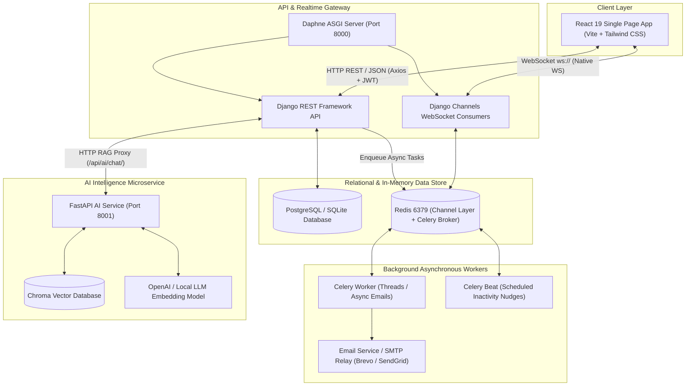
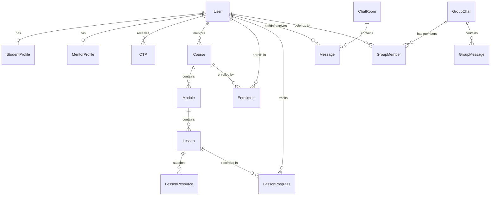

# LearnMate — Master Technical Project Documentation & System Blueprint

> **Platform**: LearnMate  
> **Version**: 2.0.0 (Production Release)  
> **Architecture**: Decoupled Microservices, Django REST Framework, React 19 SPA, FastAPI RAG Service, Django Channels WebSockets, Celery Task Pipeline  
> **Date**: August 2026  
> **PDF Export**: Available as [`LearnMate_Full_Project_Documentation.pdf`](file:///c:/vs%20code/learnmate-2/LearnMate_Full_Project_Documentation.pdf)

---

## Table of Contents
1. [Executive Overview & System Architecture](#1-executive-overview--system-architecture)
2. [Technology Stack & System Specifications](#2-technology-stack--system-specifications)
3. [Repository Directory Structure](#3-repository-directory-structure)
4. [Database Schema & Entity Relationship Model](#4-database-schema--entity-relationship-model)
5. [Authentication, Security & MFA Pipeline](#5-authentication-security--mfa-pipeline)
6. [Backend Core Architecture (Django & DRF)](#6-backend-core-architecture-django--drf)
7. [AI Microservice & RAG Tutoring Engine (FastAPI + Chroma DB)](#7-ai-microservice--rag-tutoring-engine-fastapi--chroma-db)
8. [Real-time WebSockets Messaging System (Django Channels + Redis)](#8-real-time-websockets-messaging-system-django-channels--redis)
9. [Asynchronous Background Task & Scheduling Pipeline (Celery + Redis)](#9-asynchronous-background-task--scheduling-pipeline-celery--redis)
10. [Frontend Architecture & Client State (React 19 + Vite + Tailwind CSS)](#10-frontend-architecture--client-state-react-19--vite--tailwind-css)
11. [Comprehensive HTTP REST API Reference](#11-comprehensive-http-rest-api-reference)
12. [Deployment, Local Setup & Verification Guide](#12-deployment-local-setup--verification-guide)

---

## 1. Executive Overview & System Architecture

**LearnMate** is an enterprise-grade, multi-role Learning Management System (LMS) and collaborative real-time platform engineered to bridge the gap between **Students**, **Mentors**, and **Platform Administrators**. 

LearnMate combines core course authoring and consumption workflows with advanced AI capabilities (Retrieval-Augmented Generation grounded in lesson video transcripts), instant bidirectional messaging via WebSockets, and asynchronous task scheduling for automated student engagement.

### System Architecture Diagram



### Core Value Propositions & Highlights
- **Three-Tier Role Management**:
  - **Student**: Course catalog discovery, enrollment, modular video lesson player, real-time AI Tutor grounded in lesson transcripts, progress tracker, and 1-on-1/group chat with mentors.
  - **Mentor**: Course creation studio, syllabus & module hierarchy builder, video transcript & resource upload, student progress tracking, batch and direct student messaging.
  - **Admin**: Platform user management, mentor verification approval/rejection workflows, course publication moderation, AI tutor interaction audit logs, and analytical system reports.
- **RAG-Powered AI Tutoring**: Automatically chunks uploaded lesson transcripts, stores high-dimensional semantic embeddings in Chroma DB, and retrieves relevant lecture context when students ask questions.
- **Bi-directional WebSockets**: Instant messaging without polling, supporting both 1-on-1 direct conversations and batch group discussions.
- **Non-Blocking Task Execution**: Asynchronous email delivery (OTPs, password resets, enrollment confirmations) and scheduled periodic re-engagement reminders powered by Celery & Redis.

---

## 2. Technology Stack & System Specifications

| Layer / Component | Technology | Version / Specification | Key Function & Responsibilities |
|---|---|---|---|
| **Frontend Framework** | React | `19.x` | Component lifecycle, UI rendering, reactive state |
| **Build & Dev Tooling** | Vite | `8.x` | Lightning-fast HMR and optimized production bundling |
| **Client Routing** | React Router DOM | `7.x` | Role-based protected routes and nested layouts |
| **Styling & Design System** | Tailwind CSS | `v4.x` | Modern utility classes, glassmorphism, responsive grid |
| **Iconography** | Lucide React | `0.4x` | Consistent, lightweight SVG icons |
| **HTTP Communication** | Axios | `1.18.x` | REST calls with automatic JWT token refresh interceptors |
| **Backend Core** | Python & Django | Python `3.10+`, Django `6.0.x` | Core ORM models, business logic, URL routing |
| **REST API Engine** | Django REST Framework | `3.17.x` | Model serializers, role permissions, viewsets |
| **ASGI / WebSockets** | Daphne & Django Channels | Channels `4.x`, Daphne ASGI | WebSocket protocol routing and async consumers |
| **Realtime Channel Layer** | Redis | Redis Server + `channels_redis` | Distributed real-time channel message broker |
| **Task Queue & Scheduler** | Celery & Celery Beat | `5.x`, `django-celery-beat` | Non-blocking async background tasks and cron jobs |
| **AI RAG Microservice** | FastAPI & Uvicorn | FastAPI `0.110+` | Dedicated high-throughput semantic search & RAG pipeline |
| **Vector Database** | Chroma DB | `0.5+` | Persistent vector store with cosine similarity matching |
| **Relational Storage** | PostgreSQL / SQLite | SQLite (dev) / PostgreSQL (prod) | ACID relational data persistence with foreign key constraints |

---

## 3. Repository Directory Structure

```
learnmate-2/
├── backend/
│   ├── core/                      # Root configuration module
│   │   ├── __init__.py
│   │   ├── settings.py            # Global settings (DB, JWT, Celery, CORS, Channels)
│   │   ├── urls.py                # Master API routing (/api/...)
│   │   ├── asgi.py                # ASGI entrypoint routing HTTP and WebSockets
│   │   ├── wsgi.py                # WSGI entrypoint
│   │   └── celery.py              # Celery application instantiation
│   ├── apps/
│   │   ├── accounts/              # User models, JWT Auth, OTP & TOTP MFA
│   │   │   ├── models.py
│   │   │   ├── views.py
│   │   │   ├── serializers.py
│   │   │   └── urls.py
│   │   ├── profiles/              # StudentProfile & MentorProfile management
│   │   │   ├── models.py
│   │   │   ├── views.py
│   │   │   └── serializers.py
│   │   ├── courses/               # Course, Module, Lesson, Resource, Enrollment models
│   │   │   ├── models.py
│   │   │   ├── views.py
│   │   │   ├── serializers.py
│   │   │   └── urls.py
│   │   ├── chat/                  # Direct & Group WebSocket consumers & message models
│   │   │   ├── models.py
│   │   │   ├── consumers.py
│   │   │   ├── routing.py
│   │   │   └── views.py
│   │   ├── adminpanel/            # Admin analytics, user moderation, report generation
│   │   │   └── views/
│   │   └── ai/                    # Django-to-FastAPI RAG gateway proxy
│   ├── manage.py
│   └── requirements.txt
│
├── ai-service/
│   ├── main.py                    # FastAPI application routes (/embed, /rag-chat)
│   ├── services/
│   │   ├── embeddings.py          # Sliding window chunker & vector embedder
│   │   ├── vectorstore.py         # Chroma DB collection manager
│   │   └── rag.py                 # Retrieval & LLM response generator
│   ├── chroma_data/               # Persistent Chroma vector database
│   └── requirements.txt
│
├── frontend/
│   ├── index.html
│   ├── package.json
│   ├── vite.config.js
│   └── src/
│       ├── api.js                 # Axios instance with 401 JWT refresh interceptor
│       ├── App.jsx                # Role-based route tree
│       ├── index.css              # Global styles & Tailwind CSS imports
│       ├── context/
│       │   └── AuthContext.jsx    # Global authentication & user state provider
│       ├── components/
│       │   ├── ProtectedRoute.jsx # Role and authentication guard wrapper
│       │   ├── DashboardLayout.jsx# Standard dashboard chrome with Sidebar & Topbar
│       │   ├── Sidebar.jsx        # Dynamic role-aware navigation sidebar
│       │   ├── Topbar.jsx         # User profile menu & notification status
│       │   ├── ChatComponent.jsx  # 1-on-1 WebSocket chat window
│       │   ├── GroupChatComponent.jsx # Group cohort WebSocket chat window
│       │   └── LessonAIChat.jsx   # Slide-over AI Tutor grounded in lesson content
│       └── pages/
│           ├── auth/              # Login, Register, VerifyOtp, ForgotPassword
│           └── dashboards/
│               ├── admin/         # Admin dashboard, users, mentors, courses, reports
│               ├── mentor/        # Mentor overview, course editor, students, chat
│               └── student/       # Student catalog, enrolled courses, lesson player
│
├── LearnMate_Full_Project_Documentation.pdf # Publication-ready PDF documentation
└── FULL_PROJECT_DOCUMENTATION.md            # Master markdown documentation file
```

---

## 4. Database Schema & Entity Relationship Model



### Detailed Table Specifications

#### 1. `apps.accounts.models.User`
- **`id`** (`UUIDField`, Primary Key, `default=uuid.uuid4`): Globally unique user identifier.
- **`email`** (`EmailField`, Unique): Unique login and communication identifier (`USERNAME_FIELD`).
- **`username`** (`CharField`, max 150): Display handle.
- **`role`** (`CharField`, choices: `admin`, `mentor`, `student`, default: `student`).
- **`is_verified`** (`BooleanField`, default: `False`): Verified upon completing email OTP check.
- **`mfa_enabled`** (`BooleanField`, default: `False`): Flags whether TOTP 2FA is active.
- **`mfa_secret`** (`CharField`, null=True): Cryptographic seed for TOTP RFC 6238 generation.
- **`created_at`**, **`updated_at`** (`DateTimeField`): Audit timestamps.

#### 2. `apps.accounts.models.OTP`
- **`user`** (`ForeignKey` -> `User`, `on_delete=CASCADE`): Recipient user.
- **`code`** (`CharField`, length 6): Randomly generated numeric passcode.
- **`otp_type`** (`CharField`, choices: `email_verification`, `login`, `password_reset`).
- **`is_used`** (`BooleanField`, default: `False`): Single-use invalidation flag.
- **`created_at`** (`DateTimeField`, `auto_now_add=True`): Used to enforce 5-minute validity window.

#### 3. `apps.profiles.models.StudentProfile` & `MentorProfile`
- **`StudentProfile`**: `user` (OneToOne), `bio` (TextField), `grade` (CharField), `learning_goal` (TextField).
- **`MentorProfile`**: `user` (OneToOne), `specialization` (CharField), `experience` (IntegerField in years).

#### 4. `apps.courses.models.Course`
- **`title`** (`CharField`, max 255): Course name.
- **`description`** (`TextField`): Course overview and outcomes.
- **`thumbnail`** (`ImageField`): Course cover image.
- **`mentor`** (`ForeignKey` -> `User`, `related_name="courses"`): Author/instructor.
- **`level`** (`CharField`, choices: `beginner`, `intermediate`, `advanced`).
- **`duration`** (`CharField`): Estimated time to complete (e.g., `"12 hours"`).
- **`status`** (`CharField`, choices: `draft`, `published`, `rejected`, default: `draft`).

#### 5. `apps.courses.models.Module` & `Lesson`
- **`Module`**: `course` (FK), `title` (CharField), `description` (TextField), `order` (PositiveIntegerField).
- **`Lesson`**: `module` (FK), `title` (CharField), `description` (TextField), `lesson_type` (`video`, `pdf`, `quiz`, `assignment`), `video_url` (URLField), `duration` (CharField), `order` (PositiveIntegerField), `is_preview` (BooleanField), `transcript` (TextField - English processed transcript for RAG), `original_transcript` (TextField), `transcript_status` (`pending`, `processing`, `completed`, `failed`).

#### 6. `apps.courses.models.LessonResource`
- **`lesson`** (`ForeignKey` -> `Lesson`, `related_name="resources"`): Parent lesson.
- **`title`** (`CharField`): Resource title.
- **`resource_type`** (`CharField`, choices: `pdf`, `document`, `image`, `video`, `link`, `zip`, `other`).
- **`file`** (`FileField`, upload_to=`"lesson_resources/"`): Attached document.
- **`external_url`** (`URLField`, null=True): Optional external reference link.

#### 7. `apps.courses.models.Enrollment` & `LessonProgress`
- **`Enrollment`**: `student` (FK User), `course` (FK Course), `enrolled_at` (DateTimeField), `is_completed` (BooleanField), `completed_at` (DateTimeField, nullable), `is_active` (BooleanField). Unique constraint on `("student", "course")`.
- **`LessonProgress`**: `student` (FK User), `lesson` (FK Lesson), `is_completed` (BooleanField), `completed_at` (DateTimeField). Unique constraint on `("student", "lesson")`.

#### 8. `apps.chat.models.ChatRoom`, `Message`, `GroupChat`, `GroupMessage`
- **`ChatRoom`**: `user1` (FK), `user2` (FK). Unique constraint `("user1", "user2")`.
- **`Message`**: `room` (FK ChatRoom), `sender` (FK User), `receiver` (FK User), `message` (TextField), `is_read` (BooleanField), `created_at` (DateTimeField).
- **`GroupChat`**: `name` (CharField), `created_by` (FK User), `group_type` (`student_batch`, `mentor_group`).
- **`GroupMember`**: `group` (FK GroupChat), `user` (FK User).
- **`GroupMessage`**: `group` (FK GroupChat), `sender` (FK User), `message` (TextField), `created_at` (DateTimeField).

---

## 5. Authentication, Security & MFA Pipeline

### 5.1 Registration & Email Verification
1. User submits details to `POST /api/accounts/register/`.
2. Backend generates a `User` instance with `is_verified=False` and calls the `send_otp` service.
3. An `OTP` record with `otp_type='email_verification'` is created and an email is dispatched via Celery / SMTP.
4. User submits the 6-digit code to `POST /api/accounts/verify-otp/`. Once verified, `is_verified` is flipped to `True`.

### 5.2 Two-Step Login & Token Issuance
1. Client calls `POST /api/accounts/login-otp/` with `email` and `password`.
2. Backend authenticates credentials. If valid, generates a short-lived login OTP and sends it to the user's verified email.
3. Client prompts user for the OTP and submits to `POST /api/accounts/verify-login-otp/`.
4. Backend verifies the code, invalidates the OTP (`is_used=True`), and issues a SimpleJWT token pair:
   - **`access` token**: Signed JWT (HMAC-SHA256) valid for 30–60 minutes.
   - **`refresh` token**: Signed JWT valid for 1–7 days.

### 5.3 RFC 6238 TOTP Multi-Factor Authentication
- Users can enable Authenticator App 2FA via `POST /api/accounts/mfa/enable/`.
- Backend generates a base32 TOTP secret with `pyotp.random_base32()` and returns an `otpauth://` URI rendered into a QR code with `qrcode`.
- User scans the QR code into Google Authenticator or 1Password and verifies the 6-digit rolling code via `POST /api/accounts/mfa/verify/` to permanently activate `mfa_enabled=True`.

---

## 6. Backend Core Architecture (Django & DRF)

The Django backend sits in `backend/` and exposes REST endpoints under `/api/`:

```python
# backend/core/urls.py
urlpatterns = [
    path('admin/', admin.site.urls),
    path('api/accounts/', include('apps.accounts.urls')),
    path('api/profile/', include('apps.profiles.urls')),
    path('api/courses/', include('apps.courses.urls')),
    path('api/chat/', include('apps.chat.urls')),
    path('api/adminpanel/', include('apps.adminpanel.urls')),
    path('api/ai/', include('apps.ai.urls')),
]
```

### Core ASGI Setup (`backend/core/asgi.py`)
Directs standard HTTP requests to Django WSGI/ASGI handlers and routes WebSocket connections (`ws/`) through Channels:

```python
application = ProtocolTypeRouter({
    "http": get_asgi_application(),
    "websocket": AllowedHostsOriginValidator(
        JWTAuthMiddlewareStack(
            URLRouter(chat.routing.websocket_urlpatterns)
        )
    ),
})
```

---

## 7. AI Microservice & RAG Tutoring Engine (FastAPI + Chroma DB)

Located in `ai-service/`, this independent high-performance microservice is dedicated to semantic chunking, high-dimensional vector embeddings, and Retrieval-Augmented Generation (RAG).

### 7.1 Text Ingestion & Vectorization (`POST /embed`)
When a mentor enters or updates a lesson transcript:
1. Backend calls `http://localhost:8001/embed` passing `lesson_id`, `course_id`, and `transcript_text`.
2. The AI service splits the transcript into semantically rich chunks (typically 250-500 words with overlap).
3. Text chunks are passed through a sentence-transformer embedding model to generate 384-dimensional dense vectors.
4. Chunks and embeddings are stored in Chroma DB with metadata tags `{"course_id": course_id, "lesson_id": lesson_id}`.

### 7.2 Course-Grounded Retrieval & Synthesis (`POST /rag-chat`)
When a student asks a question in the lesson viewer:
1. Client sends query to Django backend `/api/ai/chat/` with `course_id`.
2. Django proxies the payload to FastAPI `POST http://localhost:8001/rag-chat`.
3. The AI service embeds the query and performs a nearest-neighbor similarity search against Chroma DB chunks matching the `course_id`.
4. Retrieved transcript chunks are formatted into a system prompt:
   ```text
   You are the LearnMate AI Tutor. Answer the student's question using ONLY the provided course excerpts.
   Course Excerpts:
   {retrieved_chunks}
   
   Student Question:
   {question}
   ```
5. The LLM generates a grounded, accurate response with precise timestamps and concept citations.

---

## 8. Real-time WebSockets Messaging System (Django Channels + Redis)

Bidirectional messaging runs on Django Channels, Daphne, and Redis Channel Layer (`channels_redis`).

### 8.1 WebSocket Endpoints
- **Direct 1-on-1 Chat**: `ws://<host>/ws/chat/<receiver_id>/`
- **Group Batch Chat**: `ws://<host>/ws/group-chat/<group_id>/`

### 8.2 Consumer Connection Lifecycle (`apps/chat/consumers.py`)
1. **Handshake & Auth**: The consumer validates user identity from the JWT access token and accepts connection.
2. **Channel Group Joining**: Computes deterministic group name (e.g. `chat_user1_user2`) and joins Redis group via `self.channel_layer.group_add()`.
3. **Message Receive**:
   - Parses incoming JSON payload `{ "message": "...", "receiver_id": "..." }`.
   - Persists message to the relational database `Message` table.
   - Broadcasts the message object to all active channel group subscribers.
4. **Disconnect**: Cleans up Redis channel bindings via `self.channel_layer.group_discard()`.

---

## 9. Asynchronous Background Task & Scheduling Pipeline (Celery + Redis)

Background jobs and periodic timers are orchestrated by Celery with a Redis broker:

### Key Tasks:
1. **`send_async_otp_email(user_email, otp_code, otp_type)`**: Sends transactional OTP emails without blocking the HTTP worker.
2. **`send_course_completion_notification(student_id, course_id)`**: Dispatches congratulations and completion badges.
3. **`daily_learning_reminder_nudge()`**: Celery Beat cron job that runs periodically to detect inactive students and dispatch motivational study nudges.

---

## 10. Frontend Architecture & Client State (React 19 + Vite + Tailwind CSS)

### 10.1 Global State & Context (`AuthContext.jsx`)
Maintains current authentication state, active user profile, role permissions, and global login/logout methods:
- `user`: Authenticated user object (`id`, `email`, `username`, `role`).
- `login(credentials)`: Executes OTP/JWT login sequence.
- `logout()`: Clears `localStorage` (`access_token`, `refresh_token`, `user`) and redirects to `/login`.

### 10.2 Role-Based Routing (`App.jsx` & `ProtectedRoute.jsx`)
Routes are strictly partitioned by role:
- **Public Routes**: `/login`, `/register`, `/verify-otp`, `/forgot-password`, `/reset-password`.
- **Student Dashboard** (`role="student"`):
  - `/dashboard/student/` (Overview, continuous learning feed)
  - `/dashboard/student/courses/` (Course catalog)
  - `/dashboard/student/courses/:courseId/` (Course viewer)
  - `/dashboard/student/lessons/:lessonId/` (Interactive video player with AI Tutor drawer)
  - `/dashboard/student/chat/` (Real-time mentor messaging)
- **Mentor Dashboard** (`role="mentor"`):
  - `/dashboard/mentor/` (Overview, student metrics)
  - `/dashboard/mentor/courses/` (Course studio & syllabus editor)
  - `/dashboard/mentor/students/` (Enrolled student tracking)
  - `/dashboard/mentor/chat/` (Student chat and batch messaging)
- **Admin Dashboard** (`role="admin"`):
  - `/dashboard/admin/` (System overview, platform health)
  - `/dashboard/admin/users/` (User directory & status management)
  - `/dashboard/admin/mentors/` (Mentor verification review)
  - `/dashboard/admin/courses/` (Course moderation & approval)
  - `/dashboard/admin/reports/` (System performance & analytics)

### 10.3 Automatic Token Refresh Interceptor (`api.js`)
Axios instance automatically attaches `Bearer <access_token>` to all requests. On `401 Unauthorized` responses:
1. Queues the original request.
2. Calls `POST /api/accounts/token/refresh/` using stored `refresh_token`.
3. If successful, updates `access_token` in `localStorage` and retries all queued requests.
4. If refresh fails, purges credentials and triggers a clean logout.

---

## 11. Comprehensive HTTP REST API Reference

### 11.1 Authentication & Accounts (`/api/accounts/`)

| Method | Endpoint | Description | Auth Required |
|---|---|---|---|
| POST | `/api/accounts/register/` | Register new student/mentor account | None |
| POST | `/api/accounts/send-otp/` | Send email verification OTP | None |
| POST | `/api/accounts/verify-otp/` | Verify email address using 6-digit OTP | None |
| POST | `/api/accounts/login-otp/` | Validate credentials & dispatch login OTP | None |
| POST | `/api/accounts/verify-login-otp/` | Verify login OTP & issue JWT access/refresh pair | None |
| POST | `/api/accounts/forgot-password/` | Dispatch password reset OTP | None |
| POST | `/api/accounts/reset-password/` | Reset password using OTP code | None |
| POST | `/api/accounts/token/` | SimpleJWT direct token acquisition | None |
| POST | `/api/accounts/token/refresh/` | Obtain fresh access token using refresh token | None |
| POST | `/api/accounts/mfa/enable/` | Generate TOTP secret and QR code URI | Bearer Token |
| POST | `/api/accounts/mfa/verify/` | Verify TOTP code and enable 2FA | Bearer Token |

### 11.2 Profiles (`/api/profile/`)

| Method | Endpoint | Description | Auth Required |
|---|---|---|---|
| GET | `/api/profile/student/` | Get current student profile | Bearer (Student) |
| PUT | `/api/profile/student/` | Update student profile (bio, grade, goals) | Bearer (Student) |
| GET | `/api/profile/mentor/` | Get current mentor profile | Bearer (Mentor) |
| PUT | `/api/profile/mentor/` | Update mentor profile (specialization, experience) | Bearer (Mentor) |

### 11.3 Course Management (`/api/courses/`)

| Method | Endpoint | Description | Auth Required |
|---|---|---|---|
| GET | `/api/courses/` | List all courses for mentor/admin | Bearer (Mentor/Admin) |
| POST | `/api/courses/` | Create new course draft | Bearer (Mentor) |
| GET | `/api/courses/<id>/` | Retrieve course details | Bearer (Mentor/Admin) |
| PUT | `/api/courses/<id>/` | Update course metadata | Bearer (Mentor/Admin) |
| DELETE | `/api/courses/<id>/` | Delete course | Bearer (Mentor/Admin) |
| GET | `/api/courses/<id>/modules/` | List modules in a course | Bearer (Mentor) |
| POST | `/api/courses/<id>/modules/` | Add module to a course | Bearer (Mentor) |
| GET | `/api/courses/modules/<id>/lessons/` | List lessons inside a module | Bearer (Mentor) |
| POST | `/api/courses/modules/<id>/lessons/` | Add lesson to a module | Bearer (Mentor) |
| GET | `/api/courses/lessons/<id>/` | Retrieve lesson detail & transcript | Bearer (Mentor) |
| PUT | `/api/courses/lessons/<id>/` | Update lesson transcript/video/order | Bearer (Mentor) |
| DELETE | `/api/courses/lessons/<id>/` | Delete lesson | Bearer (Mentor) |
| GET | `/api/courses/lessons/<id>/resources/` | List attached lesson resources | Bearer (Mentor) |
| POST | `/api/courses/lessons/<id>/resources/` | Upload PDF/link lesson resource | Bearer (Mentor) |

### 11.4 Student Course View & Progress (`/api/courses/student/`)

| Method | Endpoint | Description | Auth Required |
|---|---|---|---|
| GET | `/api/courses/student/` | Browse catalog of published courses | Bearer (Student) |
| POST | `/api/courses/student/enroll/<course_id>/` | Enroll student into target course | Bearer (Student) |
| GET | `/api/courses/student/my-courses/` | List courses currently enrolled by student | Bearer (Student) |
| GET | `/api/courses/student/<id>/` | Get student view of course details | Bearer (Student) |
| GET | `/api/courses/student/<id>/modules/` | View course module syllabus | Bearer (Student) |
| GET | `/api/courses/student/modules/<id>/lessons/` | View lessons inside a module | Bearer (Student) |
| GET | `/api/courses/student/lessons/<id>/` | View lesson content & video player | Bearer (Student) |
| POST | `/api/courses/student/lessons/<id>/complete/` | Mark lesson as completed | Bearer (Student) |
| GET | `/api/courses/student/courses/<id>/progress/` | Get student progress percentage | Bearer (Student) |

### 11.5 Chat & Messaging (`/api/chat/`)

| Method | Endpoint | Description | Auth Required |
|---|---|---|---|
| GET | `/api/chat/history/<receiver_id>/` | Fetch historical 1-on-1 direct messages | Bearer Token |
| GET | `/api/chat/groups/` | List all group chats joined by user | Bearer Token |
| GET | `/api/chat/groups/<group_id>/messages/` | Fetch historical group messages | Bearer Token |

### 11.6 AI Tutor Endpoint (`/api/ai/`)

| Method | Endpoint | Description | Auth Required |
|---|---|---|---|
| POST | `/api/ai/chat/` | Send query to AI Tutor (proxies to FastAPI RAG) | Bearer Token |

### 11.7 Admin Panel (`/api/adminpanel/`)

| Method | Endpoint | Description | Auth Required |
|---|---|---|---|
| GET | `/api/adminpanel/dashboard/` | High-level platform statistics | Bearer (Admin) |
| GET | `/api/adminpanel/users/` | List all registered platform users | Bearer (Admin) |
| PUT | `/api/adminpanel/users/<id>/` | Toggle active status or user role | Bearer (Admin) |
| GET | `/api/adminpanel/mentors/` | List mentor verification applications | Bearer (Admin) |
| PUT | `/api/adminpanel/mentors/<id>/` | Approve or reject mentor status | Bearer (Admin) |
| GET | `/api/adminpanel/courses/` | List courses awaiting moderation | Bearer (Admin) |
| PUT | `/api/adminpanel/courses/<id>/` | Approve/publish or reject course | Bearer (Admin) |
| GET | `/api/adminpanel/reports/` | System analytics and usage reporting | Bearer (Admin) |

---

## 12. Deployment, Local Setup & Verification Guide

### 12.1 Prerequisites
- Python 3.10 or higher
- Node.js 18+ and npm
- Redis Server (listening on `127.0.0.1:6379`)

### 12.2 Step-by-Step Service Startup

#### 1. Start Redis
```bash
redis-server
```

#### 2. Start Django Backend (Port 8000)
```bash
cd backend
python -m venv venv
# Windows:
venv\Scripts\activate
# Linux/macOS:
source venv/bin/activate

pip install -r requirements.txt
python manage.py migrate
python manage.py runserver 0.0.0.0:8000
```

#### 3. Start Celery Worker & Beat (Background Tasks)
```bash
# In backend virtualenv:
# Terminal A (Worker):
celery -A core worker --loglevel=info -P threads

# Terminal B (Beat Scheduler):
python -m celery -A core beat --loglevel=info
```

#### 4. Start AI RAG Microservice (Port 8001)
```bash
cd ai-service
python -m venv venv
# Windows:
venv\Scripts\activate
# Linux/macOS:
source venv/bin/activate

pip install -r requirements.txt
uvicorn main:app --reload --port 8001
```

#### 5. Start React Frontend (Port 5173)
```bash
cd frontend
npm install
npm run dev
```

---

## Verification & Health Check

1. **Frontend**: Open `http://localhost:5173/` in a browser.
2. **Django Backend**: Visit `http://localhost:8000/api/accounts/register/` (returns HTTP 405 Method Not Allowed or Swagger docs).
3. **AI Microservice**: Visit `http://localhost:8001/health` (returns `{"status":"ok"}`).
4. **WebSocket Echo Test**: Connect to `ws://localhost:8000/ws/chat/<uuid>/` with JWT token.

---
*Documentation compiled and verified for LearnMate Platform release 2.0.0.*
