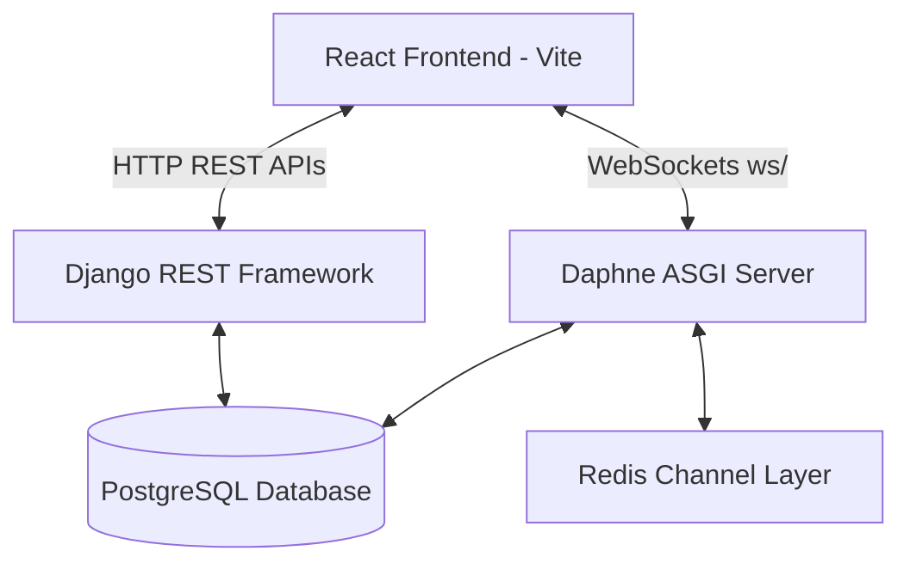

# LearnMate Project Documentation & API Reference

LearnMate is a role-based learning management and collaboration platform that supports three primary user roles: **Student**, **Mentor**, and **Admin**. 

This documentation is designed to provide humans and AI agents (such as ChatGPT or Gemini) a complete, deep understanding of the architecture, database schema, HTTP REST APIs, real-time WebSocket communication, and frontend/backend integration details.

---

## Table of Contents
1. [System Architecture & Tech Stack](#1-system-architecture--tech-stack)
2. [Key Product Features](#2-key-product-features)
3. [Database Models & Relationships](#3-database-models--relationships)
4. [Authentication & Security Flows](#4-authentication--security-flows)
5. [HTTP REST API Reference](#5-http-rest-api-reference)
6. [Real-time WebSockets Chat Protocol](#6-real-time-websockets-chat-protocol)
7. [Frontend Architecture & Client State](#7-frontend-architecture--client-state)
8. [Setup and Execution Guidelines](#8-setup-and-execution-guidelines)

---

## 1. System Architecture & Tech Stack

LearnMate follows a decoupled, client-server architecture:



### Backend (`/backend`)
- **Framework**: Django 6.0.x with Django REST Framework (DRF) 3.17.x.
- **WebSocket Engine**: Django Channels with Daphne ASGI server and `channels_redis` backend.
- **Database**: PostgreSQL (configured in `settings.py` via environment variables).
- **Authentication**: Custom JWT Authentication with `djangorestframework-simplejwt`.
- **Security**: Time-expiring OTP validation, TOTP Multi-Factor Authentication via `pyotp` and QR code generator (`qrcode`).
- **Notification Delivery**: SMTP integration for sending transactional OTPs (e.g. Brevo).

### Frontend (`/frontend`)
- **Core Library**: React 19.x & React DOM 19.x.
- **Routing**: React Router DOM v7.
- **Styling**: TailwindCSS v4.
- **Build Tool**: Vite 8.x.
- **Network client**: Axios 1.18.x with interceptors for auth headers and token rotation.

---

## 2. Key Product Features

### A. Multi-Role User Portals (RBAC)
Users sign up with one of three roles: `student`, `mentor`, or `admin`. Upon registration, they are automatically placed into the corresponding Django Group (`Student`, `Mentor`, or `Admin`). Portals are secured via role-based API permissions:
- **Student Dashboard**: Tracks streak counts, current course progress, recent activities (Assignments, Lessons, Quizzes), recommended courses, download resources, and a simulated/custom AI Tutor chat.
- **Mentor Dashboard**: Tracks course assignments, mentor profiles, and enables real-time student messaging.
- **Admin Dashboard**: Aggregates platform-wide user statistics (active counts, verification rates, MFA enrollment) and highlights recent signups.

### B. Security & Multi-Factor Authentication (MFA)
- **Email Verification**: User registration requires verification via a 6-digit numeric OTP code delivered to the user's email, expiring in 5 minutes.
- **MFA Flow**: Upon email verification, a unique TOTP base32 secret is generated and returned as a QR code (base64 image). Users must scan this QR code and verify a code to activate MFA. Subsequent logins require password verification, followed by a valid 6-digit MFA token.
- **Password Reset**: Expiring password reset tokens sent to registered emails allow secure password changes.

### C. Real-Time Chat System
- Built on top of Django Channels. Students and Mentors are connected via WebSocket chat rooms.
- Features include live instant message exchange, persistent database logging, real-time typing indicators, and user online/offline presence updates.

---

## 3. Database Models & Relationships

The project has four main apps: `accounts`, `profiles`, `dashboard`, and `chat`.

### App: `accounts`
#### `User` (extends `AbstractUser`)
- `id`: `UUIDField` (Primary Key)
- `email`: `EmailField` (Unique, Username field)
- `role`: `CharField` (Choices: `admin`, `mentor`, `student`)
- `is_verified`: `BooleanField` (Email verified status)
- `mfa_enabled`: `BooleanField`
- `mfa_secret`: `CharField` (TOTP secret)

#### `OTP`
- `user`: `ForeignKey` to `User`
- `code`: `CharField(max_length=6)`
- `otp_type`: `CharField` (Choices: `email_verification`, `login`, `password_reset`)
- `created_at`: `DateTimeField(auto_now_add=True)`
- `is_used`: `BooleanField`

### App: `profiles`
#### `StudentProfile`
- `user`: `OneToOneField` to `User` (`related_name="student_profile"`)
- `bio`: `TextField`
- `grade`: `CharField`
- `learning_goal`: `TextField`

#### `MentorProfile`
- `user`: `OneToOneField` to `User` (`related_name="mentor_profile"`)
- `specialization`: `CharField`
- `experience`: `IntegerField`

### App: `dashboard`
#### `Course`
- `title`: `CharField`
- `description`: `TextField`
- `code`: `CharField(unique=True)` (e.g. `PHY-301`)
- `difficulty`: `CharField`
- `lessons_count`: `IntegerField`

#### `CourseEnrollment`
- `student`: `ForeignKey` to `User`
- `course`: `ForeignKey` to `Course`
- `progress`: `IntegerField` (0-100)
- `is_active`: `BooleanField`

#### `StudentActivity`
- `student`: `ForeignKey` to `User`
- `activity_name`: `CharField`
- `category`: `CharField` (e.g. `Assignment`, `Lesson`, `Quiz`)
- `status`: `CharField` (e.g. `COMPLETED`, `PENDING`)
- `timestamp`: `CharField` (e.g. `2 hours ago`)
- `score`: `CharField`

#### `StudentStreak`
- `student`: `OneToOneField` to `User`
- `days`: `IntegerField`

#### `Resource`
- `name`: `CharField`
- `size`: `CharField` (e.g. `2.4 MB`)
- `file_type`: `CharField` (e.g. `PDF Document`)
- `course`: `ForeignKey` to `Course`

#### `Message` (Simulated internal messages)
- `sender`: `ForeignKey` to `User`
- `receiver_name`: `CharField`
- `text`: `TextField`
- `timestamp`: `CharField`
- `is_read`: `BooleanField`
- `initials`: `CharField`

#### `AIChatMessage` (AI Tutor history log)
- `student`: `ForeignKey` to `User`
- `sender`: `CharField` (`ai` or `user`)
- `text`: `TextField`
- `timestamp`: `DateTimeField(auto_now_add=True)`

### App: `chat`
#### `ChatRoom`
- `student`: `ForeignKey` to `User`
- `mentor`: `ForeignKey` to `User`
- **Constraint**: Unique student-mentor pairing.

#### `Message`
- `room`: `ForeignKey` to `ChatRoom`
- `sender`: `ForeignKey` to `User`
- `receiver`: `ForeignKey` to `User`
- `message`: `TextField`
- `is_read`: `BooleanField`
- `created_at`: `DateTimeField(auto_now_add=True)`

---

## 4. Authentication & Security Flows

### Registration and Verification Flow
1. Client calls `POST /api/accounts/register/`.
2. Client calls `POST /api/accounts/send-otp/`.
3. User receives email with 6-digit code.
4. Client calls `POST /api/accounts/verify-otp/`. Response contains a base64 encoded QR code to scan.
5. User scans QR code in an Authenticator app, then client calls `POST /api/accounts/verify-mfa-setup/` with the code to activate MFA.

### Login Flow (with MFA)
1. Client calls `POST /api/accounts/login/` with email and password.
2. If credentials match and email is verified, API returns:
   ```json
   {
     "message": "Credentials verified",
     "email": "user@example.com",
     "mfa_required": true
   }
   ```
3. Client displays TOTP entry page.
4. Client calls `POST /api/accounts/verify-mfa/` with the code.
5. If valid, response returns the JWT tokens:
   ```json
   {
     "access": "eyJhbGciOiJIUzI...access_token",
     "refresh": "eyJhbGciOiJIUzI...refresh_token",
     "role": "student"
   }
   ```

---

## 5. HTTP REST API Reference

All requests and responses use JSON format. JWT Auth requires the header: `Authorization: Bearer <access_token>` on protected routes.

### accounts App API

#### 1. Register User
- **Endpoint**: `POST /api/accounts/register/`
- **Auth Required**: No
- **Request Body**:
  ```json
  {
    "username": "john",
    "email": "john@example.com",
    "password": "Password123!",
    "role": "student"
  }
  ```
- **Response (`201 Created`)**:
  ```json
  {
    "massage": "User Registered Successfully",
    "data": { "username": "john", "email": "john@example.com", "role": "student" }
  }
  ```

#### 2. Send Verification OTP
- **Endpoint**: `POST /api/accounts/send-otp/`
- **Auth Required**: No
- **Request Body**: `{ "email": "john@example.com" }`
- **Response (`200 OK`)**: `{ "message": "OTP sent successfully" }`

#### 3. Verify Verification OTP
- **Endpoint**: `POST /api/accounts/verify-otp/`
- **Auth Required**: No
- **Request Body**: `{ "email": "john@example.com", "otp": "123456" }`
- **Response (`200 OK`)**:
  ```json
  {
    "message": "Email verified successfully. Scan QR code to setup MFA.",
    "qr_code": "iVBORw0KGgoAAAANS..." // Base64 raw PNG QR code
  }
  ```

#### 4. Resend Verification OTP
- **Endpoint**: `POST /api/accounts/resend-otp/`
- **Auth Required**: No
- **Request Body**: `{ "email": "john@example.com" }`
- **Response (`200 OK`)**: `{ "message": "A fresh OTP has been sent to your email." }`

#### 5. Verify MFA Setup
- **Endpoint**: `POST /api/accounts/verify-mfa-setup/`
- **Auth Required**: No
- **Request Body**: `{ "email": "john@example.com", "code": "654321" }`
- **Response (`200 OK`)**: `{ "message": "Registration completed successfully" }`

#### 6. MFA Credentials Login
- **Endpoint**: `POST /api/accounts/login/`
- **Auth Required**: No
- **Request Body**: `{ "email": "john@example.com", "password": "Password123!" }`
- **Response (`200 OK`)**:
  ```json
  {
    "message": "Credentials verified",
    "email": "john@example.com",
    "mfa_required": true
  }
  ```

#### 7. Verify MFA Login Token
- **Endpoint**: `POST /api/accounts/verify-mfa/`
- **Auth Required**: No
- **Request Body**: `{ "email": "john@example.com", "code": "654321" }`
- **Response (`200 OK`)**:
  ```json
  {
    "access": "eyJhb...",
    "refresh": "eyJhb...",
    "role": "student"
  }
  ```

#### 8. Forgot Password OTP Request
- **Endpoint**: `POST /api/accounts/forgot-password/`
- **Auth Required**: No
- **Request Body**: `{ "email": "john@example.com" }`
- **Response (`200 OK`)**: `{ "message": "Reset OTP sent successfully" }`

#### 9. Reset Password with OTP
- **Endpoint**: `POST /api/accounts/reset-password/`
- **Auth Required**: No
- **Request Body**:
  ```json
  {
    "email": "john@example.com",
    "otp": "123456",
    "new_password": "NewSecretPassword123!"
  }
  ```
- **Response (`200 OK`)**: `{ "message": "Password reset successful" }`

#### 10. Refresh JWT Token
- **Endpoint**: `POST /api/accounts/token/refresh/`
- **Auth Required**: No
- **Request Body**: `{ "refresh": "<refresh_token>" }`
- **Response (`200 OK`)**: `{ "access": "<new_access_token>" }`

---

### profiles App API

#### 1. Get Student Profile
- **Endpoint**: `GET /api/profile/student/`
- **Auth Required**: Yes (`student` role only)
- **Response (`200 OK`)**:
  ```json
  {
    "username": "john",
    "email": "john@example.com",
    "bio": "Physics enthusiast.",
    "grade": "Undergrad Year 3",
    "learning_goal": "Understand quantum theory."
  }
  ```

#### 2. Update Student Profile
- **Endpoint**: `PUT /api/profile/student/`
- **Auth Required**: Yes (`student` role only)
- **Request Body**: `{ "bio": "Updated bio", "grade": "Senior", "learning_goal": "Astrophysics" }`
- **Response (`200 OK`)**: Updated profile object.

#### 3. Get Mentor Profile
- **Endpoint**: `GET /api/profile/mentor/`
- **Auth Required**: Yes (`mentor` role only)
- **Response (`200 OK`)**:
  ```json
  {
    "username": "mentor1",
    "email": "mentor1@example.com",
    "specialization": "Quantum Electrodynamics",
    "experience": 8
  }
  ```

#### 4. Update Mentor Profile
- **Endpoint**: `PUT /api/profile/mentor/`
- **Auth Required**: Yes (`mentor` role only)
- **Request Body**: `{ "specialization": "Special Relativity", "experience": 10 }`
- **Response (`200 OK`)**: Updated profile object.

---

### dashboard App API

#### 1. Get Student Dashboard Summary
- **Endpoint**: `GET /api/dashboard/student/`
- **Auth Required**: Yes (`student` role only)
- **Response (`200 OK`)**:
  Contains streak, current course details, enrolled courses list, recent activities list, recommended courses list, resources list, messages, and AI chat history logs.

#### 2. Get AI Tutor Chat Messages
- **Endpoint**: `GET /api/dashboard/student/ai-chat/`
- **Auth Required**: Yes (`student` role only)
- **Response (`200 OK`)**: Array of AI Tutor chat messages.

#### 3. Submit Message to AI Tutor
- **Endpoint**: `POST /api/dashboard/student/ai-chat/`
- **Auth Required**: Yes (`student` role only)
- **Request Body**: `{ "text": "What is time dilation?" }`
- **Response (`200 OK`)**: Returns updated list of all chat messages including the simulated AI response.

#### 4. Get Student Portal Messages list
- **Endpoint**: `GET /api/dashboard/student/messages/`
- **Auth Required**: Yes (`student` role only)

#### 5. Send Simulated Dashboard Message
- **Endpoint**: `POST /api/dashboard/student/messages/`
- **Auth Required**: Yes (`student` role only)
- **Request Body**: `{ "text": "Hello Dr.", "receiver_name": "Dr. Sarah Chen", "initials": "SC" }`

#### 6. Get Mentor Dashboard Summary
- **Endpoint**: `GET /api/dashboard/mentor/`
- **Auth Required**: Yes (`mentor` role only)

#### 7. Get Admin Dashboard Summary
- **Endpoint**: `GET /api/dashboard/admin/`
- **Auth Required**: Yes (`admin` role only)
- **Response (`200 OK`)**: User statistics counter metadata, and array of 5 recent signups.

---

### chat App API (HTTP)

#### 1. Get Chat Rooms
- **Endpoint**: `GET /api/chat/rooms/`
- **Auth Required**: Yes (Student or Mentor)
- **Response (`200 OK`)**: Returns rooms current user is member of.
  ```json
  [
    {
      "id": 1,
      "student": { "id": "...", "email": "student@example.com" },
      "mentor": { "id": "...", "email": "mentor@example.com" },
      "updated_at": "2026-07-08T12:00:00Z"
    }
  ]
  ```

#### 2. Get Room Chat History
- **Endpoint**: `GET /api/chat/rooms/<room_id>/messages/`
- **Auth Required**: Yes (Must be room member)
- **Response (`200 OK`)**: Returns list of all message objects in room.

#### 3. Mark Room Messages as Read
- **Endpoint**: `PATCH /api/chat/rooms/<room_id>/read/`
- **Auth Required**: Yes (Must be room member)
- **Response (`200 OK`)**: `{ "messages_marked_read": 3 }`

---

## 6. Real-time WebSockets Chat Protocol

WebSocket connections are authenticated via JWT query string parameters, handled by `JWTAuthMiddleware`.

### Connection URL
```text
ws://localhost:8000/ws/chat/<room_id>/?token=<access_token>
```

### Event Message Formats (JSON)

#### 1. Sending a Chat Message (Client to Server)
```json
{
  "type": "message",
  "message": "Hello, how can I solve this assignment?"
}
```
*Response broadcasted to the group (`chat_message` type):*
```json
{
  "message_data": {
    "id": 12,
    "room_id": 3,
    "message": "Hello, how can I solve this assignment?",
    "sender": { "id": "uuid-string", "email": "student@example.com", "role": "student" },
    "receiver": { "id": "uuid-string", "email": "mentor@example.com", "role": "mentor" },
    "created_at": "2026-07-08T12:45:00.000Z",
    "is_read": false
  }
}
```

#### 2. Sending Typing Indicator (Client to Server)
```json
{
  "type": "message",
  "event": "typing"
}
```
*Response broadcasted to the group:*
```json
{
  "type": "typing",
  "user": "student@example.com"
}
```

#### 3. Presence Indicators (Server Broadcasts)
When a user connects:
```json
{
  "type": "user_online",
  "user": "student@example.com"
}
```
When a user disconnects:
```json
{
  "type": "user_offline",
  "user": "student@example.com"
}
```

---

## 7. Frontend Architecture & Client State

### State Management (`AuthContext.jsx`)
`AuthContext` handles the active session by reading token values from local storage:
- `access_token`, `refresh_token`, `user_role`, `user_email`.
On startup or login, it queries the backend profile route:
- `/api/profile/student/` for `student` role.
- `/api/profile/mentor/` for `mentor` role.
- Saves profile info (`name`, `bio`, `learning_goal`, `grade` or `specialization`) into a state object accessible via `useAuth()`.

### Route Guarding (`ProtectedRoute.jsx`)
Ensures role-specific access to portal paths:
- Wraps dashboard components checking if the user's role matches `allowedRoles` array.
- Unauthorized hits are redirected to `/login`.

### Network Interceptors (`api.js`)
Configured to seamlessly renew access tokens:
- **Request Interceptor**: Extracts `access_token` from `localStorage` and injects `Authorization: Bearer <token>` to request headers.
- **Response Interceptor**: Captures `401 Unauthorized`. If triggered, it pauses requests and issues a POST to `/api/accounts/token/refresh/` using `refresh_token`. On success, it overwrites the stale access token and automatically retries the original failed API request. If token refresh fails, it cleans the browser session and routes user to `/login`.

---

## 8. Setup and Execution Guidelines

### Backend Setup
1. Setup Python virtual environment:
   ```bash
   cd backend
   python -m venv venv
   .\venv\Scripts\activate
   ```
2. Install dependencies:
   ```bash
   pip install -r requirements.txt
   ```
3. Configure environment variables in a `.env` file in the root of `/backend`:
   ```env
   SECRET_KEY=your-django-secret-key
   DEBUG=True
   DB_NAME=learnmate
   DB_USER=postgres
   DB_PASSWORD=your-postgres-password
   DB_HOST=127.0.0.1
   DB_PORT=5432
   EMAIL_HOST=smtp.brevo.com
   EMAIL_PORT=587
   EMAIL_HOST_USER=your-smtp-email
   EMAIL_HOST_PASSWORD=your-smtp-password
   EMAIL_USE_TLS=True
   DEFAULT_FROM_EMAIL=your-configured-email
   ```
4. Run migrations and seed groups/admin:
   ```bash
   python manage.py migrate
   ```
5. Start development ASGI server:
   ```bash
   python manage.py runserver
   ```

### Frontend Setup
1. Navigate to `/frontend` and install dependencies:
   ```bash
   cd frontend
   npm install
   ```
2. Start development server:
   ```bash
   npm run dev
   ```
