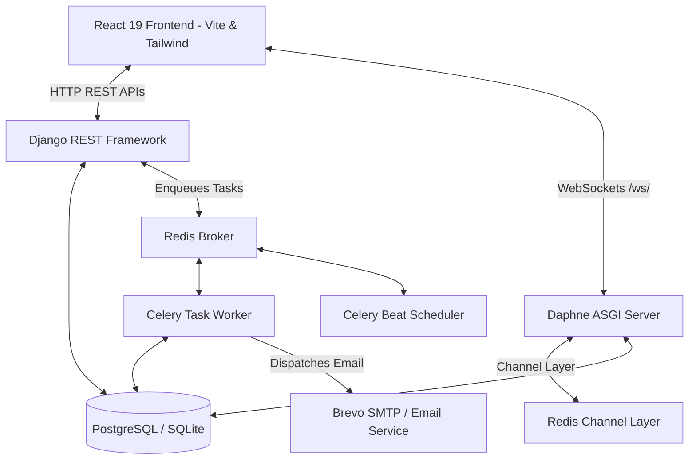
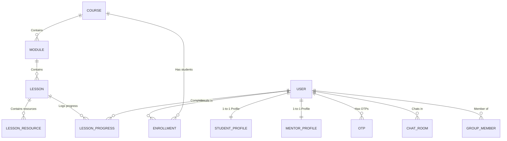
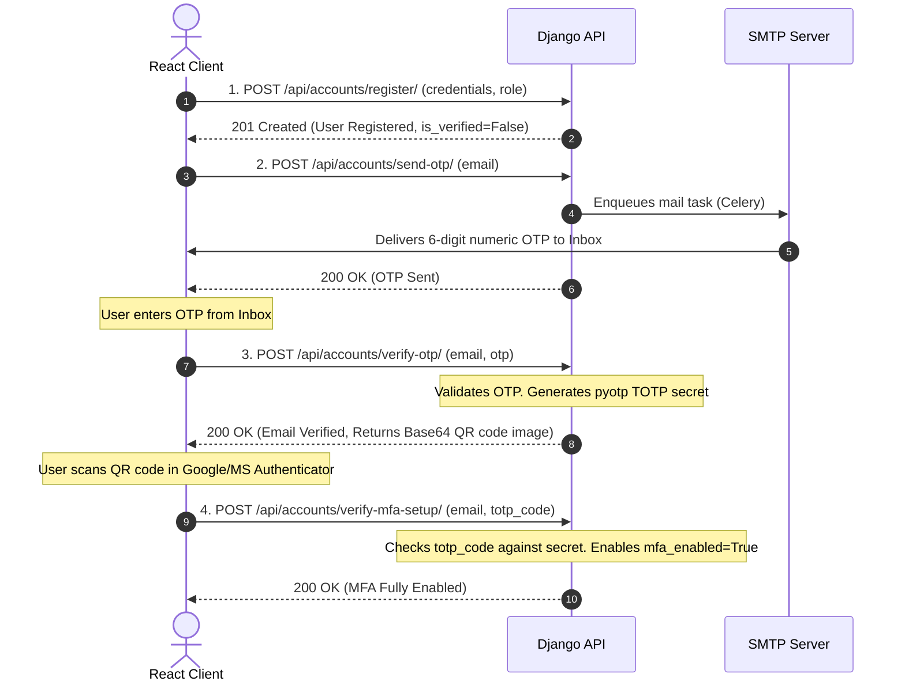
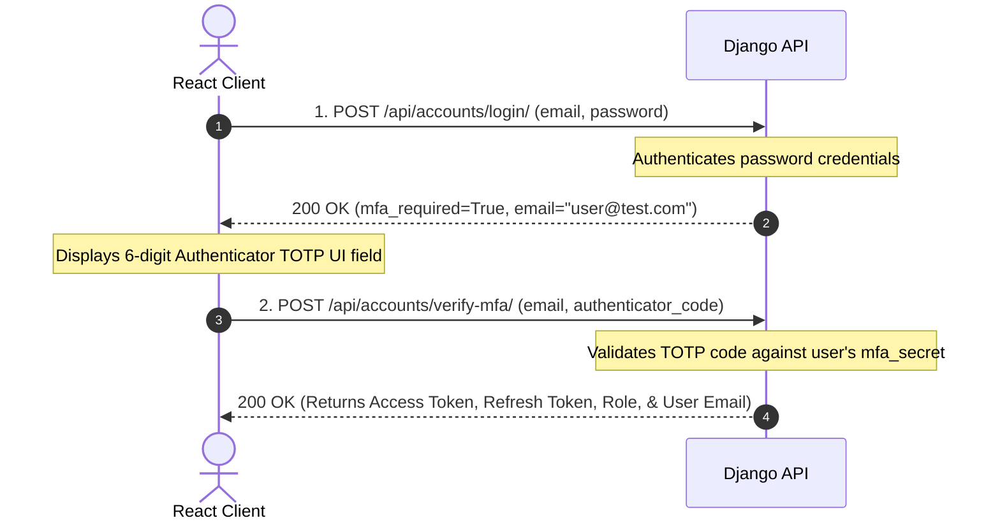
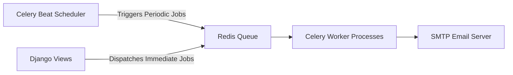
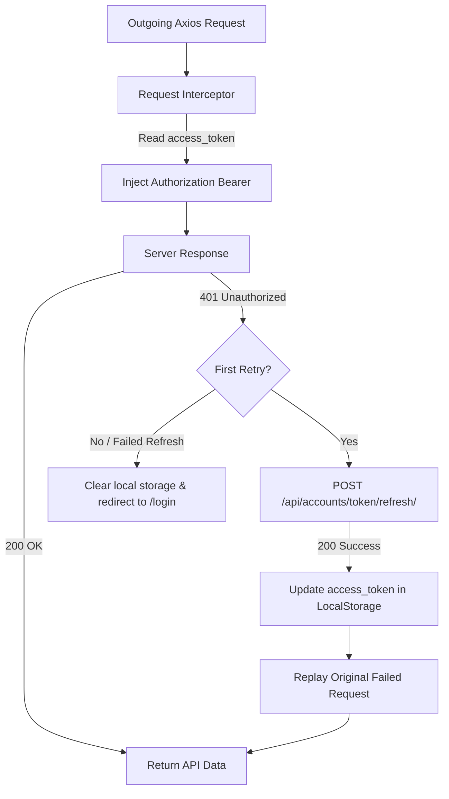

# LearnMate: Comprehensive Technical Documentation & Architecture Reference

LearnMate is a decoupled, role-based learning management system (LMS) and collaborative platform supporting three primary roles: **Student**, **Mentor**, and **Admin**. 

This document serves as the single source of truth for the LearnMate repository. It is designed to be highly readable and structured for both **human developers** onboarding or building features, and **AI systems** (coding assistants) requiring exact implementation details, schemas, security flows, and APIs.

---

## Table of Contents
1. [System Architecture & Stack Details](#1-system-architecture--stack-details)
2. [Database Schema & Model Dictionary](#2-database-schema--model-dictionary)
3. [Authentication, Security, & MFA Flows](#3-authentication-security--mfa-flows)
4. [Real-time WebSockets Chat Protocol](#4-real-time-websockets-chat-protocol)
5. [Asynchronous Workers & Background Tasks](#5-asynchronous-workers--background-tasks)
6. [Frontend Client Architecture & Client State](#6-frontend-client-architecture--client-state)
7. [HTTP REST API Reference Guide](#7-http-rest-api-reference-guide)
8. [Developer Setup & Environment Installation](#8-developer-setup--environment-installation)

---

## 1. System Architecture & Stack Details

LearnMate relies on a decoupled client-server model. Frontend interfaces request dynamic data via HTTP REST endpoints and exchange instant events using WebSockets, while the backend coordinates tasks asynchronously using Celery and Redis.



### Backend Architecture (`/backend`)
*   **Web Framework**: Django 6.0.x with Django REST Framework (DRF) 3.17.x.
*   **Asynchronous ASGI Server**: Django Channels + Daphne webserver, utilizing `channels_redis` as the channel layer backend for broadcasting live updates.
*   **Background Jobs**: Celery worker engine utilizing Redis as the message broker and result backend.
*   **Periodic Scheduling**: Celery Beat using Django Database Scheduler (`django-celery-beat`) to trigger periodic reminders.
*   **Database**: PostgreSQL in production (configured via `.env`); SQLite (`db.sqlite3`) for local development.
*   **Security & Encryption**: Custom JWT rotation using `djangorestframework-simplejwt`. Multi-Factor Authentication (MFA) via Time-based One-Time Passwords (`pyotp`) and QR code generation (`qrcode`).
*   **Transactional SMTP Relay**: Integration with SMTP providers (such as Brevo) to send OTP verification codes and congratulatory messages.

### Frontend Architecture (`/frontend`)
*   **Core UI Library**: React 19.x & React DOM 19.x.
*   **Routing System**: React Router DOM v7 (supports role guarding and relative redirection layouts).
*   **Design System**: TailwindCSS v4 with custom responsive layouts.
*   **Network Client**: Axios 1.18.x with interceptors for token injection and automated access token refreshing (token rotation pattern).

---

## 2. Database Schema & Model Dictionary

The database is divided across five Django applications: `accounts`, `profiles`, `courses`, `dashboard`, and `chat`.



### A. App: `accounts`
Responsible for core user profiles, authentication credentials, registration verification, and MFA status.

#### `User` (Extends `AbstractUser`)
*   `id`: `UUIDField` (Primary Key, Default: UUIDv4)
*   `email`: `EmailField` (Unique; acts as the primary login identifier `USERNAME_FIELD`)
*   `role`: `CharField(max_length=20, default='student')`
    *   Choices: `admin` (Platform Administrator), `mentor` (Course Creator & Instructor), `student` (Learner)
*   `is_verified`: `BooleanField(default=False)` (Whether the user verified their email address via OTP)
*   `mfa_enabled`: `BooleanField(default=False)` (MFA enrollment state)
*   `mfa_secret`: `CharField(max_length=255, null=True, blank=True)` (TOTP Base32 secret seed)
*   `created_at`: `DateTimeField(auto_now_add=True)`
*   `updated_at`: `DateTimeField(auto_now=True)`

#### `OTP`
Handles temporal codes for registration, login, and password resets.
*   `id`: `BigAutoField` (Primary Key)
*   `user`: `ForeignKey` to `User` (on delete cascade)
*   `code`: `CharField(max_length=6)`
*   `otp_type`: `CharField(max_length=30, default='email_verification')`
    *   Choices: `email_verification`, `login`, `password_reset`
*   `created_at`: `DateTimeField(auto_now_add=True)`
*   `is_used`: `BooleanField(default=False)`

---

### B. App: `profiles`
Holds additional biographical details for student and mentor roles. Profiles are automatically instantiated via Django database signals upon user registration.

#### `StudentProfile`
*   `id`: `BigAutoField` (Primary Key)
*   `user`: `OneToOneField` to `User` (Related Name: `student_profile`, on delete cascade)
*   `bio`: `TextField(blank=True)`
*   `grade`: `CharField(max_length=50, blank=True)` (e.g., Undergraduate Year 3)
*   `learning_goal`: `TextField(blank=True)`

#### `MentorProfile`
*   `id`: `BigAutoField` (Primary Key)
*   `user`: `OneToOneField` to `User` (Related Name: `mentor_profile`, on delete cascade)
*   `specialization`: `CharField(max_length=100, blank=True)` (e.g., Quantum Electro-dynamics)
*   `experience`: `IntegerField(default=0)` (Years of teaching experience)

---

### C. App: `courses`
Tracks core learning curriculum materials, course layout trees, lesson contents, and enrollments.

#### `Course`
*   `id`: `BigAutoField` (Primary Key)
*   `title`: `CharField(max_length=255)`
*   `description`: `TextField`
*   `thumbnail`: `ImageField(upload_to="course_thumbnails/", null=True, blank=True)`
*   `mentor`: `ForeignKey` to `User` (Related Name: `courses`, on delete cascade)
*   `level`: `CharField(max_length=20)`
    *   Choices: `beginner`, `intermediate`, `advanced`
*   `duration`: `CharField(max_length=50)` (e.g., "12 Hours")
*   `status`: `CharField(max_length=20, default='draft')`
    *   Choices: `draft`, `published`
*   `created_at`: `DateTimeField(auto_now_add=True)`
*   `updated_at`: `DateTimeField(auto_now=True)`

#### `Module`
Represents units or chapters of a course.
*   `id`: `BigAutoField` (Primary Key)
*   `course`: `ForeignKey` to `Course` (Related Name: `modules`, on delete cascade)
*   `title`: `CharField(max_length=255)`
*   `description`: `TextField(blank=True, null=True)`
*   `order`: `PositiveIntegerField(default=1)` (Determines display sequence)

#### `Lesson`
*   `id`: `BigAutoField` (Primary Key)
*   `module`: `ForeignKey` to `Module` (Related Name: `lessons`, on delete cascade)
*   `title`: `CharField(max_length=255)`
*   `description`: `TextField`
*   `lesson_type`: `CharField(max_length=20)`
    *   Choices: `video`, `pdf`, `quiz`, `assignment`
*   `video_url`: `URLField(blank=True, null=True)` (Optional video lecture link)
*   `duration`: `CharField(max_length=50)` (e.g., "15 mins")
*   `order`: `PositiveIntegerField(default=1)`
*   `is_preview`: `BooleanField(default=False)` (Allows students to view before enrolling)

#### `LessonResource`
*   `id`: `BigAutoField` (Primary Key)
*   `lesson`: `ForeignKey` to `Lesson` (Related Name: `resources`, on delete cascade)
*   `title`: `CharField(max_length=255)`
*   `resource_type`: `CharField(max_length=20)`
    *   Choices: `pdf`, `document`, `image`, `video`, `link`, `zip`, `other`
*   `file`: `FileField(upload_to="lesson_resources/", null=True, blank=True)`
*   `external_url`: `URLField(null=True, blank=True)`

#### `Enrollment`
*   `id`: `BigAutoField` (Primary Key)
*   `student`: `ForeignKey` to `User` (Related Name: `enrollments`, on delete cascade)
*   `course`: `ForeignKey` to `Course` (Related Name: `enrollments`, on delete cascade)
*   `enrolled_at`: `DateTimeField(auto_now_add=True)`
*   `is_completed`: `BooleanField(default=False)`
*   `completed_at`: `DateTimeField(null=True, blank=True)`
*   `is_active`: `BooleanField(default=True)`
*   *Constraint*: Unique combination of `student` and `course`.

#### `LessonProgress`
*   `id`: `BigAutoField` (Primary Key)
*   `student`: `ForeignKey` to `User` (Related Name: `lesson_progress`, on delete cascade)
*   `lesson`: `ForeignKey` to `Lesson` (Related Name: `progress`, on delete cascade)
*   `is_completed`: `BooleanField(default=False)`
*   `completed_at`: `DateTimeField(auto_now=True)`
*   *Constraint*: Unique combination of `student` and `lesson`.

---

### D. App: `dashboard`
Holds temporary mock databases or logic for student streak calculations, activity logs, and local AI Tutor chats. Note that some endpoints (such as `StudentDashboardView`) dynamically seed fallback courses (`PHY-301`, `PHY-302`, `PHY-102`) into the database if the current user has zero active enrollments.

---

### E. App: `chat`
Stores messages and group definitions handled via Daphne ASGI channels.

#### `ChatRoom`
*   `id`: `BigAutoField` (Primary Key)
*   `user1`: `ForeignKey` to `User` (Related Name: `chats_as_user1`, on delete cascade)
*   `user2`: `ForeignKey` to `User` (Related Name: `chats_as_user2`, on delete cascade)
*   *Constraint*: Unique pairing of user1 and user2.

#### `Message` (Direct chat)
*   `id`: `BigAutoField` (Primary Key)
*   `room`: `ForeignKey` to `ChatRoom` (Related Name: `messages`, on delete cascade)
*   `sender`: `ForeignKey` to `User` (on delete cascade)
*   `receiver`: `ForeignKey` to `User` (on delete cascade)
*   `message`: `TextField`
*   `is_read`: `BooleanField(default=False)`
*   `created_at`: `DateTimeField(auto_now_add=True)`

#### `GroupChat`
*   `id`: `BigAutoField` (Primary Key)
*   `name`: `CharField(max_length=255)`
*   `created_by`: `ForeignKey` to `User` (on delete cascade)
*   `group_type`: `CharField(max_length=30)` (Choices: `student_batch`, `mentor_group`)
*   `created_at`: `DateTimeField(auto_now_add=True)`

#### `GroupMember`
*   `id`: `BigAutoField` (Primary Key)
*   `group`: `ForeignKey` to `GroupChat` (Related Name: `members`, on delete cascade)
*   `user`: `ForeignKey` to `User` (on delete cascade)
*   `joined_at`: `DateTimeField(auto_now_add=True)`

#### `GroupMessage`
*   `id`: `BigAutoField` (Primary Key)
*   `group`: `ForeignKey` to `GroupChat` (Related Name: `messages`, on delete cascade)
*   `sender`: `ForeignKey` to `User` (on delete cascade)
*   `message`: `TextField`
*   `created_at`: `DateTimeField(auto_now_add=True)`

---

## 3. Authentication, Security, & MFA Flows

Security in LearnMate is implemented as a strict step-up pipeline requiring email OTP verification first, then authenticator setup via a QR code, and finally secondary validation during standard login requests.

### User Registration & MFA Setup Sequence


### Secured MFA Login Sequence


---

## 4. Real-time WebSockets Chat Protocol

WebSocket connections are routed through Django Channels and wrapped by `JWTAuthMiddleware` to parse user details from the JWT query parameter (`?token=<JWT>`).

### Connection Addresses
*   **Direct Chat**: `ws://localhost:8000/ws/chat/<room_id>/?token=<JWT>` (Routes to `ChatConsumer`)
*   **Group Chat**: `ws://localhost:8000/ws/group/<group_id>/?token=<JWT>` (Routes to `GroupConsumer`)

### Event JSON Formats

#### 1. Outgoing Message (Client $\rightarrow$ Server)
```json
{
  "type": "message",
  "message": "Hi, I am stuck on the lesson quiz!"
}
```

#### 2. Broadcasted Message (Server $\rightarrow$ Client)
```json
{
  "message_data": {
    "id": 45,
    "room_id": 2,
    "message": "Hi, I am stuck on the lesson quiz!",
    "sender": {
      "id": "c71a34db-4b95-46f9-aa16-b8dbdf1a3f01",
      "email": "student@learnmate.com",
      "role": "student"
    },
    "receiver": {
      "id": "e0bfa932-d857-410c-99a3-5c5abfc7329b",
      "email": "mentor@learnmate.com",
      "role": "mentor"
    },
    "created_at": "2026-07-26T10:15:30.123Z",
    "is_read": false
  }
}
```

#### 3. Typing Indicators (Client $\rightarrow$ Server $\rightarrow$ Client Group)
*   **Sent by typing user**: `{ "type": "typing" }`
*   **Broadcasted to other room participants**: `{ "type": "typing", "user": "student@learnmate.com" }`

#### 4. Room Presence Updates (Server $\rightarrow$ Client Group)
*   **Connected**: `{ "type": "user_online", "user": "user@learnmate.com" }`
*   **Disconnected**: `{ "type": "user_offline", "user": "user@learnmate.com" }`

---

## 5. Asynchronous Workers & Background Tasks

Celery handles background emails and triggers scheduled activities using Redis as the message broker.



### Core Configuration
*   File: **[backend/core/celery.py](file:///c:/vs code/learnmate-2/backend/core/celery.py)**
*   Task discovery is automatic via `app.autodiscover_tasks()`.
*   Beat Scheduler utilizes the Database Scheduler (`django_celery_beat`) configured in `settings.py`.

### Task Catalog

#### `send_course_completion_email(user_id, course_id)`
*   **Trigger**: Immediate asynchronous dispatch when a student reaches `100%` course progress and posts to `/complete/`.
*   **Action**: Sends a congratulatory email to the user.

#### `send_inactivity_reminders()` (Periodic Schedule - Daily)
*   **Logic**: Scans for active, unfinished enrollments where the student has not completed any lessons for more than 3 days.
*   **Action**: Dispatches an email reminder requesting the user to continue learning and keep their streak alive.

#### `check_student_progression_nudges()` (Periodic Schedule - Daily)
*   **Logic**: Identifies students whose last completed lesson progress record is older than 3 days, and checks if they have started the next sequential lesson.
*   **Action**: Dispatches an email nudge highlighting the next lesson title (`next_lesson.title`) to maintain learning momentum.

---

## 6. Frontend Client Architecture & Client State

The React app uses a clean component lifecycle combined with automatic JWT renewal.

### API Middleware Flow & JWT Auto-Rotation


### Key Modules

#### `api.js`
*   Axios client configured with interceptors:
    *   **Request Interceptor**: Reads `access_token` from `localStorage` and appends `Authorization: Bearer <token>` to headers.
    *   **Response Interceptor**: Captures `401 Unauthorized` errors. If caught, it pauses execution, requests a new access token via `/api/accounts/token/refresh/` using `refresh_token`, saves it, updates the failed request header, and replays the original request. If rotation fails (refresh token expired), it deletes the session and redirects the window to `/login`.

#### `AuthContext.jsx`
*   State manager storing global `user` data (`name`, `email`, `role`, `bio`, `learning_goal`, etc.).
*   Provides `login()`, `logout()`, `refreshUser()`, and `loading` states to the component tree.
*   Upon login or page reload, it queries `/api/profile/student/` or `/api/profile/mentor/` based on role to load profile context.

#### `ProtectedRoute.jsx`
*   Route guard checking for authentication. If no `access_token` exists, it redirects to `/login`.
*   Supports role-based routing (e.g., `allowedRoles={['student']}`).

---

## 7. HTTP REST API Reference Guide

All protected paths require the header: `Authorization: Bearer <access_token>`.

### A. Authentication & Accounts
| Method | Endpoint | Description | Auth Required | Request Payload | Response (Success) |
|---|---|---|---|---|---|
| **POST** | `/api/accounts/register/` | Register username, email, password, and user role. | No | `{ "username": "...", "email": "...", "password": "...", "role": "..." }` | `201 Created` with user details |
| **POST** | `/api/accounts/send-otp/` | Trigger email verification OTP delivery. | No | `{ "email": "user@test.com" }` | `{ "message": "OTP sent successfully" }` |
| **POST** | `/api/accounts/verify-otp/` | Validate verification OTP; returns QR code if valid. | No | `{ "email": "...", "otp": "..." }` | `200 OK` with base64 encoded PNG QR image |
| **POST** | `/api/accounts/resend-otp/` | Send a fresh verification OTP. | No | `{ "email": "..." }` | `{ "message": "..." }` |
| **POST** | `/api/accounts/verify-mfa-setup/` | Confirm authenticator token to finalize setup. | No | `{ "email": "...", "code": "..." }` | `{ "message": "Registration completed successfully" }` |
| **POST** | `/api/accounts/login/` | Step 1 authentication. Checks password. | No | `{ "email": "...", "password": "..." }` | `{ "message": "Credentials verified", "mfa_required": true }` |
| **POST** | `/api/accounts/verify-mfa/` | Step 2 authentication. Checks TOTP code. | No | `{ "email": "...", "code": "..." }` | Returns JWT access/refresh tokens + user role |
| **POST** | `/api/accounts/forgot-password/` | Request password reset OTP. | No | `{ "email": "..." }` | `{ "message": "Reset OTP sent successfully" }` |
| **POST** | `/api/accounts/reset-password/` | Reset password using OTP. | No | `{ "email": "...", "otp": "...", "new_password": "..." }` | `{ "message": "Password reset successful" }` |
| **POST** | `/api/accounts/token/refresh/` | Rotate expired access token using refresh token. | No | `{ "refresh": "<refresh_token>" }` | `{ "access": "<new_access_token>" }` |

### B. User Profiles
| Method | Endpoint | Description | Role Required | Request Payload |
|---|---|---|---|---|
| **GET** | `/api/profile/student/` | Retrieve student profile details. | Student | None |
| **PUT** | `/api/profile/student/` | Update student bio, grade, and learning goals. | Student | `{ "bio": "...", "grade": "...", "learning_goal": "..." }` |
| **GET** | `/api/profile/mentor/` | Retrieve mentor profile details. | Mentor | None |
| **PUT** | `/api/profile/mentor/` | Update mentor specialization and experience fields. | Mentor | `{ "specialization": "...", "experience": 5 }` |

### C. Course Management (CRUD - Mentors)
| Method | Endpoint | Description | Role Required | Request Payload / Params |
|---|---|---|---|---|
| **POST** | `/api/courses/create/` | Create a new course container (defaults to draft status). | Mentor | `{ "title": "...", "description": "...", "level": "...", "duration": "..." }` |
| **GET** | `/api/courses/my-courses/` | Retrieve courses created by the mentor. | Mentor | None |
| **GET** | `/api/courses/<course_id>/` | View course details. | Mentor | None |
| **PUT** | `/api/courses/<course_id>/update/` | Update course details. | Mentor | `{ "title": "..." }` |
| **DELETE**| `/api/courses/<course_id>/delete/` | Delete course and its modules/lessons. | Mentor | None |
| **POST** | `/api/courses/modules/create/` | Add a new module to a course. | Mentor | `{ "course": course_id, "title": "...", "order": 1 }` |
| **GET** | `/api/courses/<course_id>/modules/` | List modules for a course. | Mentor | None |
| **PUT** | `/api/courses/modules/<module_id>/update/`| Update module properties. | Mentor | `{ "title": "..." }` |
| **DELETE**| `/api/courses/modules/<module_id>/delete/`| Remove module. | Mentor | None |
| **POST** | `/api/courses/lessons/create/` | Add lesson to a module. | Mentor | `{ "module": module_id, "title": "...", "lesson_type": "..." }` |
| **GET** | `/api/courses/modules/<module_id>/lessons/`| List lessons in a module. | Mentor | None |
| **PUT** | `/api/courses/lessons/<lesson_id>/update/`| Update lesson details. | Mentor | `{ "title": "..." }` |
| **DELETE**| `/api/courses/lessons/<lesson_id>/delete/`| Remove lesson. | Mentor | None |
| **POST** | `/api/courses/<course_id>/publish/` | Set course status to published (makes it public).| Mentor | None |
| **POST** | `/api/courses/<course_id>/unpublish/` | Revert course status to draft. | Mentor | None |

### D. Course Learning (Students)
| Method | Endpoint | Description | Role Required | Request Payload |
|---|---|---|---|---|
| **GET** | `/api/courses/` | Retrieve all public (published) courses. | Student | None |
| **GET** | `/api/courses/student/<course_id>/` | Fetch module and lesson tree structure. | Student | None |
| **POST** | `/api/courses/student/<course_id>/enroll/` | Enroll in a course. | Student | None |
| **GET** | `/api/courses/student/my-courses/` | Retrieve courses enrolled by the student. | Student | None |
| **POST** | `/api/courses/lessons/<lesson_id>/complete/`| Mark a lesson as completed. | Student | None |
| **GET** | `/api/courses/student/courses/<course_id>/progress/`| Get course enrollment completion percentage. | Student | None |
| **GET** | `/api/courses/student/courses/<course_id>/continue/`| Get the next uncompleted lesson in a course. | Student | None |
| **POST** | `/api/courses/student/courses/<course_id>/complete/`| Complete course (100% progress). Triggers Celery email. | Student | None |

### E. Analytics & Dashboards
| Method | Endpoint | Description | Role Required | Response Details |
|---|---|---|---|---|
| **GET** | `/api/dashboard/student/` | Student dashboard summary (enrolled, recommended, stats). | Student | Streaks, recent activity list, recommended list |
| **GET** | `/api/courses/mentor/dashboard/` | Mentor analytics. | Mentor | Enrolled student counts, completion rates, courses |
| **GET** | `/api/courses/mentor/courses/<course_id>/students/` | View enrolled students in a course. | Mentor | List of student profiles + progress percentages |
| **GET** | `/api/courses/mentor/courses/<course_id>/statistics/`| Detailed statistics for a course. | Mentor | Aggregated progress stats |
| **GET** | `/api/courses/admin/dashboard/` | Platform-wide course metrics. | Admin | Total courses, lessons, users, enrollments |
| **GET** | `/api/dashboard/admin/` | Platform-wide user metrics. | Admin | Users count, verified count, MFA count, recent signups |

### F. Collaborative Chat
| Method | Endpoint | Description | Role Required | Request Payload |
|---|---|---|---|---|
| **GET** | `/api/chat/rooms/` | List all direct chat rooms for the current user. | Authenticated | None |
| **GET** | `/api/chat/rooms/<room_id>/messages/` | Retrieve direct chat room message history. | Room Member | None |
| **PATCH**| `/api/chat/rooms/<room_id>/read/` | Mark all room messages as read. | Room Member | None |
| **GET** | `/api/chat/groups/` | List group chats the user belongs to. | Authenticated | None |
| **GET** | `/api/chat/groups/<group_id>/messages/` | Retrieve group message history. | Group Member | None |
| **POST** | `/api/chat/groups/create/` | Create a new group chat room. | Mentor / Admin | `{ "name": "...", "group_type": "..." }` |

---

## 8. Developer Setup & Environment Installation

Follow these steps to run the frontend and backend applications locally.

### Prerequisites
*   Python 3.10+
*   Node.js 18+
*   Redis Server (running on `localhost:6379`)

---

### Backend Service Setup

1.  **Navigate to the backend directory and create a virtual environment**:
    ```bash
    cd backend
    python -m venv venv
    ```
2.  **Activate the virtual environment**:
    *   **Windows**: `.\venv\Scripts\activate`
    *   **macOS/Linux**: `source venv/bin/activate`
3.  **Install dependencies**:
    ```bash
    pip install -r requirements.txt
    ```
4.  **Configure environment variables**:
    Create a `.env` file in the `/backend` folder:
    ```env
    SECRET_KEY=your-django-secret-key
    DEBUG=True
    DB_NAME=learnmate
    DB_USER=postgres
    DB_PASSWORD=your-postgres-password
    DB_HOST=127.0.0.1
    DB_PORT=5432
    
    # Celery Broker configuration
    CELERY_BROKER_URL=redis://127.0.0.1:6379/0
    CELERY_RESULT_BACKEND=redis://127.0.0.1:6379/0
    
    # SMTP configuration (e.g., Brevo)
    EMAIL_HOST=smtp.brevo.com
    EMAIL_PORT=587
    EMAIL_HOST_USER=your-smtp-email-address
    EMAIL_HOST_PASSWORD=your-smtp-api-key
    EMAIL_USE_TLS=True
    DEFAULT_FROM_EMAIL=no-reply@learnmate.com
    ```
5.  **Run database migrations**:
    ```bash
    python manage.py migrate
    ```
6.  **Start application servers**:
    *   **ASGI Web Server (Daphne / Django runserver)**:
        ```bash
        python manage.py runserver
        ```
    *   **Celery Worker Processor** (Open a new terminal):
        *   *Windows (Force thread pool pool)*: `python -m celery -A core worker --loglevel=info -P threads`
        *   *macOS/Linux (standard pool)*: `celery -A core worker -l info`
    *   **Celery Beat Scheduler** (Open a new terminal):
        ```bash
        python -m celery -A core beat -l info
        ```

---

### Frontend Client Setup

1.  **Navigate to the frontend directory**:
    ```bash
    cd ../frontend
    ```
2.  **Install dependencies**:
    ```bash
    npm install
    ```
3.  **Start Vite development server**:
    ```bash
    npm run dev
    ```
    The application will be accessible at `http://localhost:5173`.
