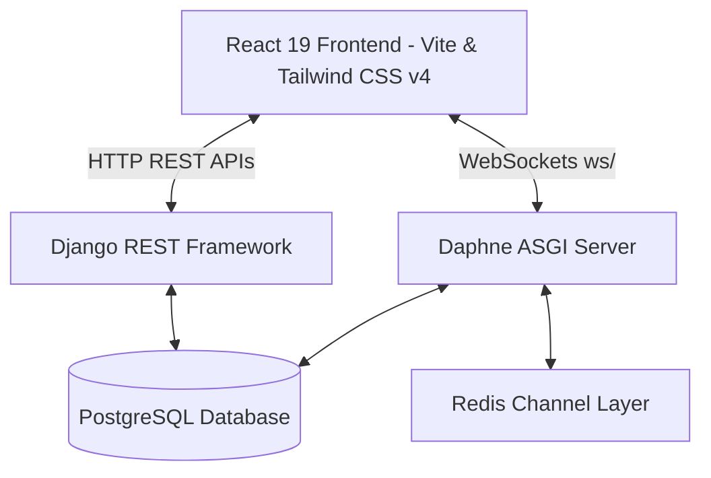
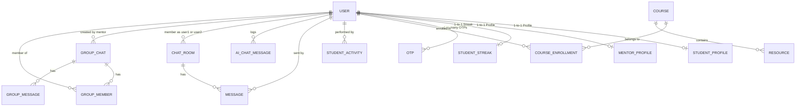
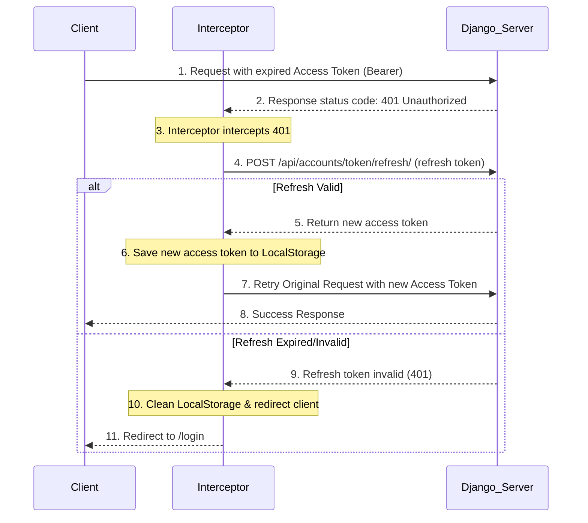

# LearnMate Comprehensive Project Documentation & API Reference

LearnMate is a decoupled, role-based learning management and collaboration platform designed to support three user roles: **Student**, **Mentor**, and **Admin**. 

This documentation serves as a complete reference guide for developers, system architects, and AI agents. It contains deep details on the system architecture, database models, security and MFA configurations, REST APIs, real-time WebSocket interfaces, frontend client flow, and setup instructions.

---

## Table of Contents
1. [System Architecture & Tech Stack](#1-system-architecture--tech-stack)
2. [Database Schema & App Architecture](#2-database-schema--app-architecture)
3. [Authentication & Security Flow](#3-authentication--security-flow)
4. [HTTP REST API Reference](#4-http-rest-api-reference)
5. [Real-time WebSockets Communication Protocol](#5-real-time-websockets-communication-protocol)
6. [Frontend Client Architecture & State Flow](#6-frontend-client-architecture--state-flow)
7. [Installation & Setup Guide](#7-installation--setup-guide)

---

## 1. System Architecture & Tech Stack

LearnMate is built with a modern, decoupled client-server architecture:



### Backend (`/backend`)
*   **Core Framework**: Django 6.0.x
*   **API Framework**: Django REST Framework (DRF) 3.17.x
*   **Real-time Engine**: Django Channels with Daphne ASGI server and `channels_redis` backend.
*   **Database**: PostgreSQL (fallback or dev SQLite is available as configured).
*   **Auth Layer**: JSON Web Tokens (JWT) using `djangorestframework-simplejwt`.
*   **MFA (MFA/TOTP)**: Custom two-factor auth flow leveraging Time-based One-Time Passwords (`pyotp`) and QR code generator (`qrcode`).
*   **Mailing System**: Django `django.core.mail` integration using SMTP settings for OTP delivery (e.g. Brevo).

### Frontend (`/frontend`)
*   **Core Framework**: React 19.x & React DOM 19.x.
*   **Routing Engine**: React Router DOM v7.
*   **Styling**: Tailwind CSS v4.
*   **Build Tool**: Vite 8.x.
*   **API Connection**: Axios client equipped with request and response interceptors to handle silent access token renewals via refresh tokens.

---

## 2. Database Schema & App Architecture

The Django backend is structured into four main applications: `accounts`, `profiles`, `dashboard`, and `chat`.



### A. App: `accounts`
Handles user accounts, authentication permissions, and OTP/MFA secrets.

#### Model: `User` (Extends `AbstractUser`)
*   `id`: `UUIDField` (Primary Key, Default: UUIDv4)
*   `username`: `CharField(max_length=150)`
*   `email`: `EmailField` (Unique, **USERNAME_FIELD**)
*   `role`: `CharField(max_length=20, default='student')`
    *   Choices: `admin`, `mentor`, `student`
*   `is_verified`: `BooleanField(default=False)` (Verified email flag)
*   `mfa_enabled`: `BooleanField(default=False)` (MFA enrollment flag)
*   `mfa_secret`: `CharField(max_length=255, null=True, blank=True)` (TOTP Base32 secret)
*   `created_at`: `DateTimeField(auto_now_add=True)`
*   `updated_at`: `DateTimeField(auto_now=True)`

#### Model: `OTP`
Used for transient email verification, logins, and password resets.
*   `user`: `ForeignKey` to `User` (Cascade deletion)
*   `code`: `CharField(max_length=6)`
*   `otp_type`: `CharField(max_length=30, default='email_verification')`
    *   Choices: `email_verification`, `login`, `password_reset`
*   `created_at`: `DateTimeField(auto_now_add=True)`
*   `is_used`: `BooleanField(default=False)`

---

### B. App: `profiles`
Tracks supplementary information specific to user roles. Profile generation is triggered asynchronously via Django signals `post_save` on `User` creations.

#### Model: `StudentProfile`
*   `user`: `OneToOneField` to `User` (Related Name: `student_profile`)
*   `bio`: `TextField(blank=True)`
*   `grade`: `CharField(max_length=50, blank=True)`
*   `learning_goal`: `TextField(blank=True)`

#### Model: `MentorProfile`
*   `user`: `OneToOneField` to `User` (Related Name: `mentor_profile`)
*   `specialization`: `CharField(max_length=100, blank=True)`
*   `experience`: `IntegerField(default=0)`

---

### C. App: `dashboard`
Powers dashboards with courses, mock system notifications, activities, streaks, and local AI Tutor chats.

#### Model: `Course`
*   `title`: `CharField(max_length=255)`
*   `description`: `TextField(blank=True)`
*   `code`: `CharField(max_length=50, unique=True)` (e.g. `PHY-301`)
*   `difficulty`: `CharField(max_length=50, default='Beginner')`
*   `lessons_count`: `IntegerField(default=1)`

#### Model: `CourseEnrollment`
*   `student`: `ForeignKey` to `User`
*   `course`: `ForeignKey` to `Course`
*   `progress`: `IntegerField(default=0)` (0 to 100 percentage)
*   `is_active`: `BooleanField(default=True)`
*   *Constraint*: Unique combination of `student` and `course`.

#### Model: `StudentActivity`
*   `student`: `ForeignKey` to `User`
*   `activity_name`: `CharField(max_length=255)`
*   `category`: `CharField(max_length=100)` (Choices: `Assignment`, `Lesson`, `Quiz`)
*   `status`: `CharField(max_length=50)` (e.g., `COMPLETED`, `PENDING`)
*   `timestamp`: `CharField(max_length=100)` (e.g., `"2 hours ago"`)
*   `score`: `CharField(max_length=50, default="-")`

#### Model: `StudentStreak`
*   `student`: `OneToOneField` to `User` (Related Name: `streak`)
*   `days`: `IntegerField(default=0)`

#### Model: `Resource`
*   `name`: `CharField(max_length=255)`
*   `size`: `CharField(max_length=50)` (e.g., `"2.4 MB"`)
*   `file_type`: `CharField(max_length=100)`
*   `course`: `ForeignKey` to `Course` (Set Null on deletion)

#### Model: `Message` (Simulated notifications in student portal)
*   `sender`: `ForeignKey` to `User`
*   `receiver_name`: `CharField(max_length=255)`
*   `text`: `TextField()`
*   `timestamp`: `CharField(max_length=100)`
*   `is_read`: `BooleanField(default=False)`
*   `initials`: `CharField(max_length=10, default="JV")`

#### Model: `AIChatMessage` (Simulated local AI Tutor conversation history)
*   `student`: `ForeignKey` to `User`
*   `sender`: `CharField(max_length=10)` (Choices: `user`, `ai`)
*   `text`: `TextField()`
*   `timestamp`: `DateTimeField(auto_now_add=True)`

---

### D. App: `chat`
Manages real-time direct chats and group messaging rooms.

#### Model: `ChatRoom` (Direct chats between mentor and student)
*   `user1`: `ForeignKey` to `User` (Related Name: `chats_as_user1`)
*   `user2`: `ForeignKey` to `User` (Related Name: `chats_as_user2`)
*   `created_at`: `DateTimeField(auto_now_add=True)`
*   `updated_at`: `DateTimeField(auto_now=True)`
*   *Constraint*: Unique combination of `user1` and `user2`.

#### Model: `Message` (Direct room messages)
*   `room`: `ForeignKey` to `ChatRoom` (Related Name: `messages`)
*   `sender`: `ForeignKey` to `User`
*   `receiver`: `ForeignKey` to `User`
*   `message`: `TextField()`
*   `is_read`: `BooleanField(default=False)`
*   `created_at`: `DateTimeField(auto_now_add=True)`

#### Model: `GroupChat` (Group chats created by Mentors)
*   `name`: `CharField(max_length=100)`
*   `created_by`: `ForeignKey` to `User` (Related Name: `created_groups`)
*   `group_type`: `CharField(max_length=20, default='student_batch')`
    *   Choices: `student_batch`, `mentor_group`
*   `created_at`: `DateTimeField(auto_now_add=True)`

#### Model: `GroupMember`
*   `group`: `ForeignKey` to `GroupChat` (Related Name: `members`)
*   `user`: `ForeignKey` to `User`
*   `joined_at`: `DateTimeField(auto_now_add=True)`
*   *Constraint*: Unique combination of `group` and `user`.

#### Model: `GroupMessage`
*   `group`: `ForeignKey` to `GroupChat` (Related Name: `messages`)
*   `sender`: `ForeignKey` to `User`
*   `message`: `TextField()`
*   `created_at`: `DateTimeField(auto_now_add=True)`

---

## 3. Authentication & Security Flow

LearnMate operates a high-security authentication mechanism using time-expiring OTP validation and TOTP-based Multi-Factor Authentication.

### Registration and Verification Sequence
1.  **Sign Up**: Frontend submits credentials to `POST /api/accounts/register/`. If successful, the user is created. Django signals automatically initialize the corresponding `StudentProfile` or `MentorProfile`.
2.  **Request Email Verification**: Client calls `POST /api/accounts/send-otp/`. A 6-digit verification code is generated, stored as `otp_type='email_verification'`, and emailed.
3.  **OTP Verification**: Client calls `POST /api/accounts/verify-otp/`. If the code is correct and within the **5-minute expiry window**, the account is marked `is_verified=True`.
4.  **TOTP MFA Setup**: The verification response contains a Base64-encoded QR code. The QR code links to a provisioning URI generated from a unique Base32 TOTP secret (`mfa_secret`). The user scans this QR code in an authenticator app (like Google Authenticator).
5.  **Confirm MFA**: Client calls `POST /api/accounts/verify-mfa-setup/` with the code from the authenticator. Upon successful verification, the account sets `mfa_enabled=True`.

### Secure Login Sequence
```
Client                      Backend (Authentication Engine)
  |                                     |
  |--- 1. POST /api/accounts/login/ --->| (Check credentials, verify is_verified)
  |<-- 2. "mfa_required": true ---------| (Only returns confirmation, no tokens)
  |                                     |
  |--- 3. POST /api/accounts/verify/ -->| (Submit 6-digit TOTP code)
  |<-- 4. JWT Tokens (Access/Refresh)---| (MFA token match, login successful)
```

1.  **Phase 1 Login**: Client posts email and password to `POST /api/accounts/login/`.
2.  **MFA Request**: If credentials are valid, backend returns:
    ```json
    {
      "message": "Credentials verified",
      "email": "user@example.com",
      "mfa_required": true
    }
    ```
3.  **Phase 2 Login**: The user enters their 6-digit authenticator app code. Client posts code and email to `POST /api/accounts/verify-mfa/`.
4.  **Token Issuance**: Backend verifies the TOTP token using the user's `mfa_secret` and returns standard JWT Access & Refresh tokens.

---

## 4. HTTP REST API Reference

All requests and responses use JSON. Protected routes require the header `Authorization: Bearer <access_token>`.

### A. accounts Application Endpoints

#### 1. Register User
*   **URL**: `POST /api/accounts/register/`
*   **Auth**: No
*   **Request Body**:
    ```json
    {
      "username": "jane_doe",
      "email": "jane@example.com",
      "password": "SecurePassword123!",
      "role": "student"
    }
    ```
*   **Response (`201 Created`)**:
    ```json
    {
      "massage": "User Registered Successfully",
      "data": {
        "username": "jane_doe",
        "email": "jane@example.com",
        "role": "student"
      }
    }
    ```
    *(Note: The response key is spelled `"massage"` in the backend view)*

#### 2. Send Verification OTP
*   **URL**: `POST /api/accounts/send-otp/`
*   **Auth**: No
*   **Request Body**:
    ```json
    {
      "email": "jane@example.com"
    }
    ```
*   **Response (`200 OK`)**:
    ```json
    {
      "message": "OTP sent successfully"
    }
    ```

#### 3. Verify Verification OTP
*   **URL**: `POST /api/accounts/verify-otp/`
*   **Auth**: No
*   **Request Parameters**:
    *   `otp`: 6-digit code sent via email
*   **Request Body**:
    ```json
    {
      "email": "jane@example.com",
      "otp": "123456"
    }
    ```
*   **Response (`200 OK`)**:
    ```json
    {
      "message": "Email verified successfully. Scan QR code to setup MFA.",
      "qr_code": "iVBORw0KGgoAAAANSUhEUgAA..." // Base64 Raw PNG of the TOTP QR Code
    }
    ```

#### 4. Resend Verification OTP
*   **URL**: `POST /api/accounts/resend-otp/`
*   **Auth**: No
*   **Request Body**:
    ```json
    {
      "email": "jane@example.com"
    }
    ```
*   **Response (`200 OK`)**:
    ```json
    {
      "message": "A fresh OTP has been sent to your email."
    }
    ```

#### 5. Verify MFA Setup
*   **URL**: `POST /api/accounts/verify-mfa-setup/`
*   **Auth**: No
*   **Request Body**:
    ```json
    {
      "email": "jane@example.com",
      "code": "654321"
    }
    ```
*   **Response (`200 OK`)**:
    ```json
    {
      "message": "Registration completed successfully"
    }
    ```

#### 6. MFA Credentials Login
*   **URL**: `POST /api/accounts/login/`
*   **Auth**: No
*   **Request Body**:
    ```json
    {
      "email": "jane@example.com",
      "password": "SecurePassword123!"
    }
    ```
*   **Response (`200 OK`)**:
    ```json
    {
      "message": "Credentials verified",
      "email": "jane@example.com",
      "mfa_required": true
    }
    ```

#### 7. Verify MFA Login Token
*   **URL**: `POST /api/accounts/verify-mfa/`
*   **Auth**: No
*   **Request Body**:
    ```json
    {
      "email": "jane@example.com",
      "code": "654321" // TOTP code from authenticator app
    }
    ```
*   **Response (`200 OK`)**:
    ```json
    {
      "access": "eyJhbGciOiJIUzI1NiIsInR5cCI6IkpXVCJ9...",
      "refresh": "eyJhbGciOiJIUzI1NiIsInR5cCI6IkpXVCJ9...",
      "role": "student"
    }
    ```

#### 8. Forgot Password Request
*   **URL**: `POST /api/accounts/forgot-password/`
*   **Auth**: No
*   **Request Body**:
    ```json
    {
      "email": "jane@example.com"
    }
    ```
*   **Response (`200 OK`)**:
    ```json
    {
      "message": "Reset OTP sent successfully"
    }
    ```

#### 9. Reset Password with OTP
*   **URL**: `POST /api/accounts/reset-password/`
*   **Auth**: No
*   **Request Body**:
    ```json
    {
      "email": "jane@example.com",
      "otp": "123456",
      "new_password": "NewStrongSecurePassword99!"
    }
    ```
*   **Response (`200 OK`)**:
    ```json
    {
      "message": "Password reset successful"
    }
    ```

#### 10. Refresh JWT Token
*   **URL**: `POST /api/accounts/token/refresh/`
*   **Auth**: No
*   **Request Body**:
    ```json
    {
      "refresh": "<refresh_token>"
    }
    ```
*   **Response (`200 OK`)**:
    ```json
    {
      "access": "<new_access_token>"
    }
    ```

---

### B. profiles Application Endpoints

#### 1. Get Student Profile
*   **URL**: `GET /api/profile/student/`
*   **Auth**: Yes (User role must be `student`)
*   **Response (`200 OK`)**:
    ```json
    {
      "id": 1,
      "username": "jane_doe",
      "email": "jane@example.com",
      "bio": "Astrophysics enthusiast",
      "grade": "Year 2 Undergrad",
      "learning_goal": "Understand quantum theory fundamentals"
    }
    ```

#### 2. Update Student Profile
*   **URL**: `PUT /api/profile/student/`
*   **Auth**: Yes (User role must be `student`)
*   **Request Body**:
    ```json
    {
      "bio": "Updated bio details",
      "grade": "Year 3 Undergrad",
      "learning_goal": "Specialize in cosmology"
    }
    ```
*   **Response (`200 OK`)**: Updated profile data object.

#### 3. Get Mentor Profile
*   **URL**: `GET /api/profile/mentor/`
*   **Auth**: Yes (User role must be `mentor`)
*   **Response (`200 OK`)**:
    ```json
    {
      "id": 2,
      "username": "prof_chen",
      "email": "chen@example.com",
      "specialization": "Quantum Electrodynamics",
      "experience": 10
    }
    ```

#### 4. Update Mentor Profile
*   **URL**: `PUT /api/profile/mentor/`
*   **Auth**: Yes (User role must be `mentor`)
*   **Request Body**:
    ```json
    {
      "specialization": "Cosmology and Relativity",
      "experience": 11
    }
    ```
*   **Response (`200 OK`)**: Updated profile data object.

---

### C. dashboard Application Endpoints

#### 1. Get Student Dashboard Overview
*   **URL**: `GET /api/dashboard/student/`
*   **Auth**: Yes (User role must be `student`)
*   **Response (`200 OK`)**: Returns student stats, course progress, activities, recommendations, files, and notification history.
    ```json
    {
      "streak": 5,
      "current_course": {
        "title": "Special Relativity & Quantum Foundations",
        "description": "Understand spacetime structures and quantum foundations.",
        "code": "PHY-301",
        "difficulty": "Advanced Physics II",
        "lessons_count": 10,
        "progress": 75
      },
      "enrolled_courses": [...],
      "recent_activity": [...],
      "recommendations": [...],
      "resources": [...],
      "messages": [...],
      "ai_chat_messages": [...]
    }
    ```

#### 2. Get AI Tutor Chat History
*   **URL**: `GET /api/dashboard/student/ai-chat/`
*   **Auth**: Yes (User role must be `student`)
*   **Response (`200 OK`)**:
    ```json
    [
      { "sender": "ai", "text": "Hello jane_doe! I am your AI Tutor..." }
    ]
    ```

#### 3. Submit Message to AI Tutor
*   **URL**: `POST /api/dashboard/student/ai-chat/`
*   **Auth**: Yes (User role must be `student`)
*   **Request Body**:
    ```json
    {
      "text": "What is mass-energy equivalence?"
    }
    ```
*   **Response (`200 OK`)**: Returns complete updated array of chat messages, appending the user's inquiry and the simulated AI response.

#### 4. Get Student Portal Messages
*   **URL**: `GET /api/dashboard/student/messages/`
*   **Auth**: Yes (User role must be `student`)

#### 5. Send Simulated Dashboard Message
*   **URL**: `POST /api/dashboard/student/messages/`
*   **Auth**: Yes (User role must be `student`)
*   **Request Body**:
    ```json
    {
      "text": "Hello Dr. Sarah Chen",
      "receiver_name": "Dr. Sarah Chen",
      "initials": "SC"
    }
    ```
*   **Response (`200 OK`)**: Created message item data.

#### 6. Get Mentor Dashboard Overview
*   **URL**: `GET /api/dashboard/mentor/`
*   **Auth**: Yes (User role must be `mentor`)
*   **Response (`200 OK`)**:
    ```json
    {
      "name": "prof_chen",
      "role": "mentor",
      "message": "Mentor Dashboard"
    }
    ```

#### 7. Get Admin Dashboard Overview
*   **URL**: `GET /api/dashboard/admin/`
*   **Auth**: Yes (User role must be `admin`)
*   **Response (`200 OK`)**: Returns system statistics and metadata of the 5 most recent signups.
    ```json
    {
      "statistics": {
        "total_users": 12,
        "total_students": 8,
        "total_mentors": 3,
        "total_admins": 1,
        "verified_users": 10,
        "unverified_users": 2,
        "mfa_enabled_users": 9
      },
      "recent_users": [...]
    }
    ```

---

### D. chat Application Endpoints (HTTP)

#### 1. Get Chat Rooms List
*   **URL**: `GET /api/chat/rooms/`
*   **Auth**: Yes (Must be Room member)
*   **Response (`200 OK`)**:
    ```json
    [
      {
        "id": 1,
        "user1": { "id": "uuid-str", "email": "student@example.com", "role": "student" },
        "user2": { "id": "uuid-str", "email": "mentor@example.com", "role": "mentor" },
        "last_message": "Hello, how can I solve this assignment?",
        "updated_at": "2026-07-08T12:00:00Z"
      }
    ]
    ```

#### 2. Get Room Chat History
*   **URL**: `GET /api/chat/rooms/<room_id>/messages/`
*   **Auth**: Yes (Must be Room member)
*   **Response (`200 OK`)**: Array of chat message objects.

#### 3. Mark Messages as Read
*   **URL**: `PATCH /api/chat/rooms/<room_id>/read/`
*   **Auth**: Yes (Must be Room member)
*   **Response (`200 OK`)**:
    ```json
    {
      "messages_marked_read": 3
    }
    ```

#### 4. Get Group Chats List
*   **URL**: `GET /api/chat/groups/`
*   **Auth**: Yes
*   **Response (`200 OK`)**: List of groups created by or containing the user.

#### 5. Get Group Chat Message History
*   **URL**: `GET /api/chat/groups/<group_id>/messages/`
*   **Auth**: Yes (Must be group member)

#### 6. Create Group Chat
*   **URL**: `POST /api/chat/groups/create/`
*   **Auth**: Yes (Mentor only)
*   **Request Body**:
    ```json
    {
      "name": "Physics Batch B",
      "group_type": "student_batch"
    }
    ```
*   **Response (`201 Created`)**:
    ```json
    {
      "id": 5,
      "name": "Physics Batch B",
      "group_type": "student_batch",
      "created_by": 2,
      "created_at": "2026-07-18T10:00:00Z"
    }
    ```

---

## 5. Real-time WebSockets Communication Protocol

LearnMate utilizes WebSockets to handle real-time messaging, typing indicators, and user presence (online/offline notifications). Connections are authenticated using token-based URL parameters via `JWTAuthMiddleware`.

### Connection URL Scheme
*   **Direct Chat Room**: `ws://localhost:8000/ws/chat/<room_id>/?token=<access_token>`
*   **Group Chat**: `ws://localhost:8000/ws/group/<group_id>/?token=<access_token>`

---

### A. Direct Chat WebSocket Messages

#### 1. Client Sends Message
*   **Payload**:
    ```json
    {
      "type": "message",
      "message": "Hello, how can I solve this assignment?"
    }
    ```
*   **Server Broadcasts (`chat_message` event type)**:
    ```json
    {
      "message_data": {
        "id": 12,
        "room_id": 3,
        "message": "Hello, how can I solve this assignment?",
        "sender": { "id": "uuid-1", "email": "student@example.com", "role": "student" },
        "receiver": { "id": "uuid-2", "email": "mentor@example.com", "role": "mentor" },
        "created_at": "2026-07-18T14:45:00.000Z",
        "is_read": false
      }
    }
    ```

#### 2. Client Starts Typing
*   **Payload**:
    ```json
    {
      "type": "typing"
    }
    ```
*   **Server Broadcasts**:
    ```json
    {
      "type": "typing",
      "user": "student@example.com"
    }
    ```

#### 3. Presence Broadcasts (Server Pushed)
*   **User Connects**:
    ```json
    {
      "type": "user_online",
      "user": "student@example.com"
    }
    ```
*   **User Disconnects**:
    ```json
    {
      "type": "user_offline",
      "user": "student@example.com"
    }
    ```

---

### B. Group Chat WebSocket Messages

#### 1. Client Sends Message
*   **Payload**:
    ```json
    {
      "message": "Hello class! The Lorentz transformations set is due tomorrow."
    }
    ```
*   **Server Broadcasts (`group_message` event type)**:
    ```json
    {
      "message_data": {
        "id": 45,
        "group_id": 5,
        "message": "Hello class! The Lorentz transformations set is due tomorrow.",
        "sender": { "id": "uuid-2", "email": "mentor@example.com", "role": "mentor" },
        "created_at": "2026-07-18T15:00:00.000Z"
      }
    }
    ```

---

## 6. Frontend Client Architecture & State Flow

The React frontend utilizes a decoupled approach to handle authentication guarding and JWT rotation.

### A. State Management & API layer
*   `AuthContext.jsx`: Provides a custom hook `useAuth()` exposing properties `user`, `loading`, `login()`, `logout()`, and `refreshUser()`. Session items (`access_token`, `refresh_token`, `user_role`, `user_email`) are persisted in browser LocalStorage.
*   `ProtectedRoute.jsx`: Component-based route guard that prevents layout accessibility for unauthorized roles. Unauthenticated calls are automatically redirected back to `/login`.

### B. Axios Automatic Token Rotation Interceptor (`api.js`)
To maintain smooth sessions, the API layer retries failed requests after automatic JWT rotation:



---

## 7. Installation & Setup Guide

### System Prerequisites
*   Python 3.10+
*   Node.js 18+ (npm v9+)
*   Redis server (Required for Django Channels layer)

---

### Backend Service Setup

1.  **Clone & Navigate**:
    ```bash
    cd backend
    ```
2.  **Create Virtual Environment**:
    ```bash
    python -m venv venv
    # Windows:
    .\venv\Scripts\activate
    # macOS/Linux:
    source venv/bin/activate
    ```
3.  **Install Requirements**:
    ```bash
    pip install -r requirements.txt
    ```
4.  **Create Configuration Environment (`backend/.env`)**:
    ```env
    SECRET_KEY=django-secure-secret-key-goes-here
    DEBUG=True
    DB_NAME=learnmate
    DB_USER=postgres
    DB_PASSWORD=your-postgres-password
    DB_HOST=127.0.0.1
    DB_PORT=5432
    EMAIL_HOST=smtp.brevo.com
    EMAIL_PORT=587
    EMAIL_HOST_USER=your-smtp-email
    EMAIL_HOST_PASSWORD=your-smtp-password
    EMAIL_USE_TLS=True
    DEFAULT_FROM_EMAIL=your-configured-sender-email
    ```
5.  **Execute Database Migrations**:
    ```bash
    python manage.py migrate
    ```
6.  **Launch the ASGI Application Service**:
    ```bash
    python manage.py runserver
    ```

---

### Frontend Client Setup

1.  **Navigate & Install**:
    ```bash
    cd frontend
    npm install
    ```
2.  **Configure environment** (Verify api base URL matches backend in `frontend/src/api.js`):
    *   Default development URL is configured to: `http://127.0.0.1:8000`
3.  **Launch Client Development Server**:
    ```bash
    npm run dev
    ```
