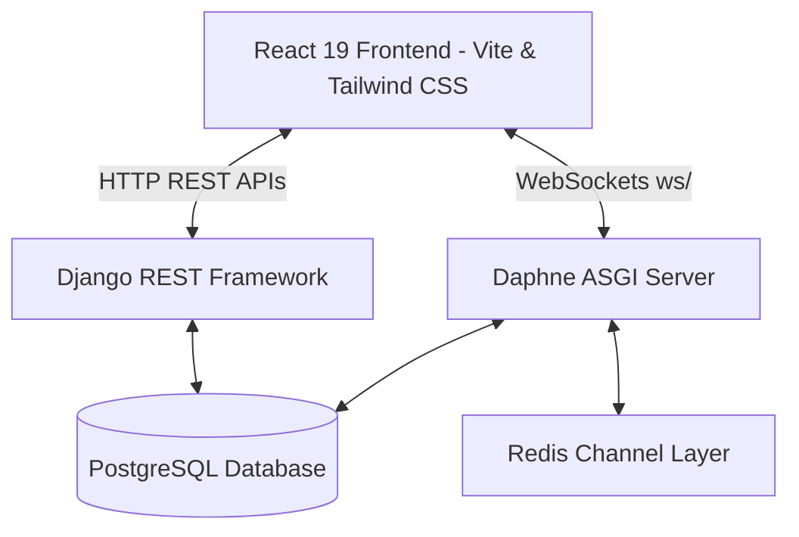
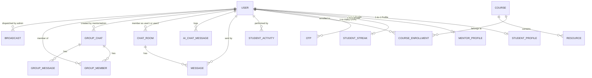

# LearnMate Technical Documentation & Architecture Reference

LearnMate is a decoupled, role-based learning management and collaboration platform designed for three user roles: **Student**, **Mentor**, and **Admin**. 

This document serves as a complete reference guide detailing the system architecture, database models, HTTP REST APIs, real-time WebSocket communication protocols, frontend architecture, and installation guides.

---

## 1. System Architecture & Tech Stack

LearnMate is built using a decoupled client-server architecture:



### Backend (`/backend`)
*   **Core Framework**: Django 6.0.x
*   **API Framework**: Django REST Framework (DRF) 3.17.x
*   **Real-time Engine**: Django Channels with Daphne ASGI server and `channels_redis` backend.
*   **Database**: PostgreSQL / SQLite for development.
*   **Auth Layer**: JSON Web Tokens (JWT) using `djangorestframework-simplejwt`.
*   **MFA**: Multi-Factor Authentication leveraging Time-based One-Time Passwords (`pyotp`) and QR code generator (`qrcode`).

### Frontend (`/frontend`)
*   **Core Framework**: React 19.x & React DOM 19.x.
*   **Routing Engine**: React Router DOM v7.
*   **Build Tool**: Vite 8.x.
*   **API Connection**: Axios client equipped with interceptors to automatically rotate JWT tokens via refresh tokens.

---

## 2. Database Schema & App Architecture

The Django backend is structured into four main applications: `accounts`, `profiles`, `dashboard`, and `chat`.



### A. App: `accounts`
Handles user accounts, authentication permissions, and OTP/MFA secrets.

#### Model: `User` (Extends `AbstractUser`)
*   `id`: `UUIDField` (Primary Key, Default: UUIDv4)
*   `username`: `CharField(max_length=150)`
*   `email`: `EmailField` (Unique, **USERNAME_FIELD**)
*   `role`: `CharField(max_length=20, default='student')`
    *   Choices: `admin`, `mentor`, `student`
*   `is_verified`: `BooleanField(default=False)`
*   `mfa_enabled`: `BooleanField(default=False)`
*   `mfa_secret`: `CharField(max_length=255, null=True, blank=True)` (TOTP Base32 secret)
*   `created_at`: `DateTimeField(auto_now_add=True)`
*   `updated_at`: `DateTimeField(auto_now=True)`

#### Model: `OTP`
Used for transient email verification, logins, and password resets.
*   `user`: `ForeignKey` to `User`
*   `code`: `CharField(max_length=6)`
*   `otp_type`: `CharField(max_length=30, default='email_verification')`
    *   Choices: `email_verification`, `login`, `password_reset`
*   `created_at`: `DateTimeField(auto_now_add=True)`
*   `is_used`: `BooleanField(default=False)`

---

### B. App: `profiles`
Tracks supplementary profile information. Profiles are generated automatically via Django signals (`post_save` on `User`).

#### Model: `StudentProfile`
*   `user`: `OneToOneField` to `User` (Related Name: `student_profile`)
*   `bio`: `TextField(blank=True)`
*   `grade`: `CharField(max_length=50, blank=True)`
*   `learning_goal`: `TextField(blank=True)`

#### Model: `MentorProfile`
*   `user`: `OneToOneField` to `User` (Related Name: `mentor_profile`)
*   `specialization`: `CharField(max_length=100, blank=True)`
*   `experience`: `IntegerField(default=0)`

---

### C. App: `dashboard`
Powers dashboards with courses, activities, streaks, resources, and local AI Tutor chats.

#### Model: `Course`
*   `title`: `CharField(max_length=255)`
*   `description`: `TextField(blank=True)`
*   `code`: `CharField(max_length=50, unique=True)`
*   `difficulty`: `CharField(max_length=50, default='Beginner')`
*   `lessons_count`: `IntegerField(default=1)`

#### Model: `CourseEnrollment`
*   `student`: `ForeignKey` to `User`
*   `course`: `ForeignKey` to `Course`
*   `progress`: `IntegerField(default=0)`
*   `is_active`: `BooleanField(default=True)`

#### Model: `StudentActivity`
*   `student`: `ForeignKey` to `User`
*   `activity_name`: `CharField(max_length=255)`
*   `category`: `CharField(max_length=100)` (Choices: `Assignment`, `Lesson`, `Quiz`)
*   `status`: `CharField(max_length=50)` (e.g., `COMPLETED`, `PENDING`)
*   `timestamp`: `CharField(max_length=100)`
*   `score`: `CharField(max_length=50, default="-")`

#### Model: `StudentStreak`
*   `student`: `OneToOneField` to `User` (Related Name: `streak`)
*   `days`: `IntegerField(default=0)`

#### Model: `Resource`
*   `name`: `CharField(max_length=255)`
*   `size`: `CharField(max_length=50)`
*   `file_type`: `CharField(max_length=100)`
*   `course`: `ForeignKey` to `Course` (Set Null on deletion)

#### Model: `Message` (Simulated notifications in student portal)
*   `sender`: `ForeignKey` to `User`
*   `receiver_name`: `CharField(max_length=255)`
*   `text`: `TextField()`
*   `timestamp`: `CharField(max_length=100)`
*   `is_read`: `BooleanField(default=False)`
*   `initials`: `CharField(max_length=10, default="JV")`

#### Model: `AIChatMessage` (Simulated local AI Tutor conversation history)
*   `student`: `ForeignKey` to `User`
*   `sender`: `CharField(max_length=10)` (Choices: `user`, `ai`)
*   `text`: `TextField()`
*   `timestamp`: `DateTimeField(auto_now_add=True)`

---

### D. App: `chat`
Manages real-time direct chats, group messaging rooms, and system-wide broadcasts.

#### Model: `ChatRoom` (Direct chats between mentor and student)
*   `user1`: `ForeignKey` to `User` (Related Name: `chats_as_user1`)
*   `user2`: `ForeignKey` to `User` (Related Name: `chats_as_user2`)
*   `created_at`: `DateTimeField(auto_now_add=True)`
*   `updated_at`: `DateTimeField(auto_now=True)`

#### Model: `Message` (Direct room messages)
*   `room`: `ForeignKey` to `ChatRoom` (Related Name: `messages`)
*   `sender`: `ForeignKey` to `User`
*   `receiver`: `ForeignKey` to `User`
*   `message`: `TextField()`
*   `is_read`: `BooleanField(default=False)`
*   `created_at`: `DateTimeField(auto_now_add=True)`

#### Model: `GroupChat` (Group chats created by Mentors or Admins)
*   `name`: `CharField(max_length=100)`
*   `created_by`: `ForeignKey` to `User` (Related Name: `created_groups`)
*   `group_type`: `CharField(max_length=20, default='student_batch')`
    *   Choices: `student_batch`, `mentor_group`
*   `created_at`: `DateTimeField(auto_now_add=True)`

#### Model: `GroupMember`
*   `group`: `ForeignKey` to `GroupChat` (Related Name: `members`)
*   `user`: `ForeignKey` to `User`
*   `joined_at`: `DateTimeField(auto_now_add=True)`

#### Model: `GroupMessage`
*   `group`: `ForeignKey` to `GroupChat` (Related Name: `messages`)
*   `sender`: `ForeignKey` to `User`
*   `message`: `TextField()`
*   `created_at`: `DateTimeField(auto_now_add=True)`

#### Model: `Broadcast` (System Announcements dispatched by Admins)
*   `sender`: `ForeignKey` to `User` (Related Name: `sent_broadcasts`)
*   `message`: `TextField()`
*   `created_at`: `DateTimeField(auto_now_add=True)`

---

## 3. Authentication & Security Flow

LearnMate operates a secure authentication mechanism using time-expiring OTP validation and TOTP-based Multi-Factor Authentication.

### Registration and Verification Sequence
1.  **Sign Up**: Frontend submits credentials to `POST /api/accounts/register/`.
2.  **Request Email Verification**: Client calls `POST /api/accounts/send-otp/`. A 6-digit verification code is generated (`otp_type='email_verification'`) and emailed.
3.  **OTP Verification**: Client calls `POST /api/accounts/verify-otp/`. If the code is correct within the **5-minute expiry window**, the account is marked `is_verified=True`.
4.  **TOTP MFA Setup**: The verification response contains a Base64-encoded QR code containing the TOTP secret (`mfa_secret`). The user scans this QR code in an authenticator app.
5.  **Confirm MFA**: Client calls `POST /api/accounts/verify-mfa-setup/` with the code from the authenticator. Upon successful verification, the account sets `mfa_enabled=True`.

### Secure Login Sequence
```
Client                      Backend (Authentication Engine)
  |                                     |
  |--- 1. POST /api/accounts/login/ --->| (Check credentials, verify is_verified)
  |<-- 2. "mfa_required": true ---------| (Only returns confirmation, no tokens)
  |                                     |
  |--- 3. POST /api/accounts/verify/ -->| (Submit 6-digit TOTP code)
  |<-- 4. JWT Tokens (Access/Refresh)---| (MFA token match, login successful)
```

---

## 4. HTTP REST API Reference

All requests and responses use JSON. Protected routes require the header `Authorization: Bearer <access_token>`.

### Key Endpoints

| Category | Endpoint | Method | Auth | Description |
| :--- | :--- | :---: | :---: | :--- |
| **Accounts** | `/api/accounts/register/` | POST | No | Registers user. Returns confirmation with key `"massage"`. |
| **Accounts** | `/api/accounts/send-otp/` | POST | No | Sends email verification OTP. |
| **Accounts** | `/api/accounts/verify-otp/` | POST | No | Verifies OTP. Returns Base64 QR code for TOTP MFA setup. |
| **Accounts** | `/api/accounts/verify-mfa-setup/` | POST | No | Confirms MFA setup and enables MFA on the account. |
| **Accounts** | `/api/accounts/login/` | POST | No | Authenticates user credentials. Returns if MFA is required. |
| **Accounts** | `/api/accounts/verify-mfa/` | POST | No | Submits TOTP. Returns JWT Access & Refresh tokens. |
| **Profiles** | `/api/profile/student/` | GET/PUT | Yes | Gets/updates Student profile info. |
| **Profiles** | `/api/profile/mentor/` | GET/PUT | Yes | Gets/updates Mentor profile info. |
| **Dashboard** | `/api/dashboard/student/` | GET | Yes | Returns student stats, course progress, recent activities. |
| **Dashboard** | `/api/dashboard/student/ai-chat/` | GET/POST| Yes | Interacts with AI Tutor chat history. |
| **Dashboard** | `/api/dashboard/admin/` | GET | Yes | Returns admin system statistics and 5 recent signups. |
| **Chat** | `/api/chat/rooms/` | GET | Yes | Lists direct chat rooms where user is a participant. |
| **Chat** | `/api/chat/rooms/<room_id>/messages/` | GET | Yes | Retrieves historical message logs for a direct chat room. |
| **Chat** | `/api/chat/rooms/<room_id>/read/` | PATCH | Yes | Marks direct chat messages as read. |
| **Chat** | `/api/chat/groups/` | GET | Yes | Lists group cohorts where user is creator or member. |
| **Chat** | `/api/chat/groups/create/` | POST | Yes | Creates group chat (restricted to Mentors and Admins). |
| **Chat** | `/api/chat/broadcasts/` | GET | Yes | Lists recent 10 system broadcasts (available to all roles). |
| **Chat** | `/api/chat/broadcasts/` | POST | Yes | Dispatches a system broadcast (restricted to Admin role). |

---

## 5. Real-time WebSockets Communication Protocol

LearnMate utilizes WebSockets to handle real-time messaging, typing indicators, user presence, and system-wide announcements. Connections are authenticated using token-based URL parameters via `JWTAuthMiddleware`.

### A. Connection URL Schemes

*   **Direct Chat Room**: `ws://localhost:8000/ws/chat/<room_id>/?token=<access_token>`
*   **Group Chat**: `ws://localhost:8000/ws/group/<group_id>/?token=<access_token>`
*   **System Broadcasts**: `ws://localhost:8000/ws/broadcast/?token=<access_token>`

---

### B. Socket Protocols & Payload Formats

#### 1. Direct Chats (`ws/chat/`)
*   **Client Sends Message**:
    ```json
    { "type": "message", "message": "Hi, check this relativity equation." }
    ```
*   **Server Broadcasts Message (`chat_message`)**:
    ```json
    {
      "message_data": {
        "id": 12, "room_id": 3, "message": "Hi, check this relativity equation.",
        "sender": { "id": "uuid-1", "email": "student@example.com", "role": "student" },
        "receiver": { "id": "uuid-2", "email": "mentor@example.com", "role": "mentor" },
        "created_at": "2026-07-18T14:45:00.000Z", "is_read": false
      }
    }
    ```
*   **Client Sends Typing Status**:
    ```json
    { "type": "typing" }
    ```
*   **Server Broadcasts Typing Indicator**:
    ```json
    { "type": "typing", "user": "student@example.com" }
    ```
*   **Presence (Online/Offline) Pushes (Server Origin)**:
    ```json
    { "type": "user_online", "user": "student@example.com" }
    { "type": "user_offline", "user": "student@example.com" }
    ```

#### 2. Group Chats (`ws/group/`)
*   **Client Sends Message**:
    ```json
    { "message": "Hello class! Homework is due tomorrow." }
    ```
*   **Server Broadcasts Message (`group_message`)**:
    ```json
    {
      "message_data": {
        "id": 45, "group_id": 5, "message": "Hello class! Homework is due tomorrow.",
        "sender": { "id": "uuid-2", "email": "mentor@example.com", "role": "mentor" },
        "created_at": "2026-07-18T15:00:00.000Z"
      }
    }
    ```

#### 3. System Broadcasts (`ws/broadcast/`)
*   **Server Pushes Real-time Broadcasts (Client Listening Mode)**:
    ```json
    {
      "type": "broadcast",
      "broadcast": {
        "id": 5,
        "message": "Platform maintenance scheduled for Sunday 2:00 AM...",
        "sender_email": "admin@example.com",
        "created_at": "2026-07-19T04:36:49.000Z"
      }
    }
    ```

---

## 6. Frontend Client Architecture & State Flow

### A. State Management & Authentication
*   `AuthContext.jsx`: Persists session parameters (`access_token`, `refresh_token`, `user_role`, `user_email`) in browser LocalStorage. Exposes hook `useAuth()` to check login status, current user profile, and user role.
*   `ProtectedRoute.jsx`: Component-based route guard that prevents access for unauthorized roles. Redirects to `/login` if unauthenticated.
*   `api.js`: Custom Axios instance fitted with response interceptors to automatically rotate JWT tokens transparently on 401 response statuses, retrying original requests once tokens are rotated.

### B. User Interfaces
*   **Admin Messages workspace (`AdminMessages.jsx`)**:
    *   Features a premium dual-tab system:
        1.  **Chat Workspace**: Imports and renders the unified `<ChatComponent />` where administrators participate in direct and cohort rooms.
        2.  **System Broadcasts**: Renders a form to publish announcements to `/api/chat/broadcasts/` and renders a log showing broadcast histories.
*   **Global Announcement Banner (`DashboardLayout.jsx`)**:
    *   Sets up a global subscription to `ws/broadcast/`.
    *   Loads historical announcements on component mount, comparing them with dismissed announcement IDs stored in `localStorage` (`dismissed_broadcast_ids`).
    *   Renders a premium dismissible banner alert below the header topbar when a new broadcast is received in real-time or when an active announcement exists.

---

## 7. Setup & Run Instructions

### Prerequisites
*   Python 3.10+
*   Node.js 18+ (npm v9+)
*   Redis server (Running on port 6379, required for Django Channels)

### Backend Service Setup
1.  Navigate to folder: `cd backend`
2.  Create virtual environment: `python -m venv venv`
3.  Activate environment:
    *   Windows: `.\venv\Scripts\activate`
    *   macOS/Linux: `source venv/bin/activate`
4.  Install dependencies: `pip install -r requirements.txt`
5.  Create environment variables in `backend/.env` matching your database credentials.
6.  Generate database schemas and apply migrations:
    ```bash
    python manage.py makemigrations
    python manage.py migrate
    ```
7.  Start server: `python manage.py runserver`

### Frontend Client Setup
1.  Navigate to folder: `cd frontend`
2.  Install dependencies: `npm install`
3.  Configure `frontend/src/api.js` base URL (Default development target is `http://127.0.0.1:8000`).
4.  Start client development server: `npm run dev`
