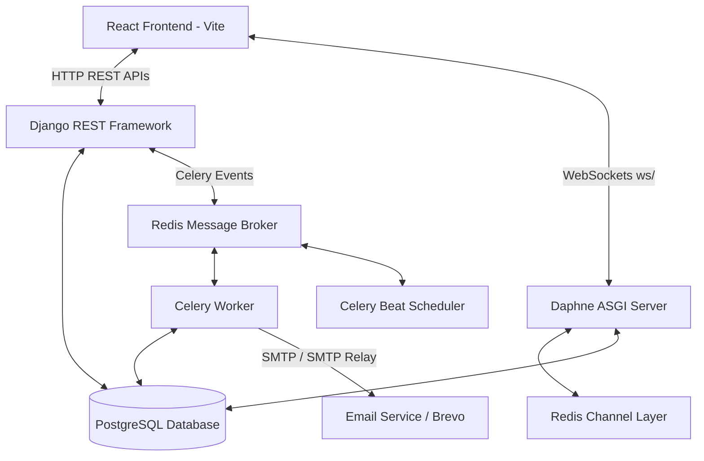
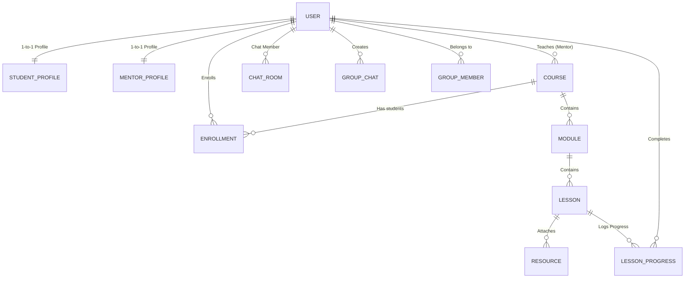
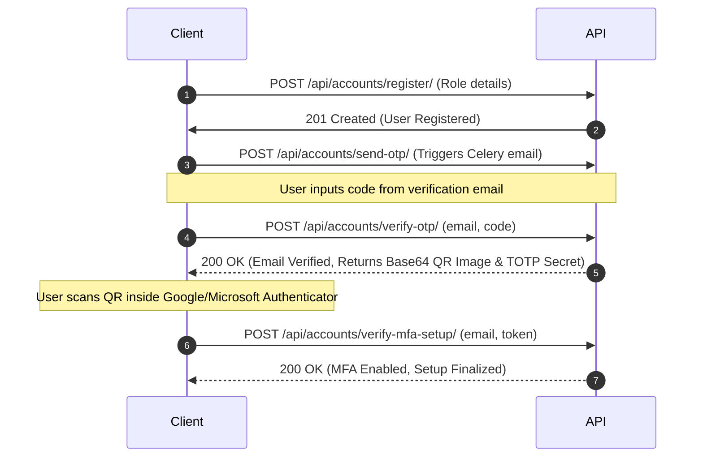
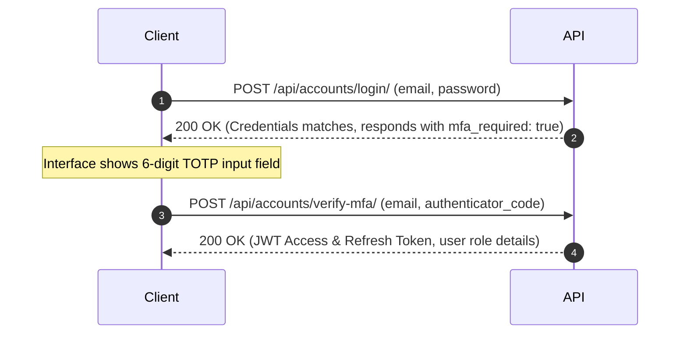
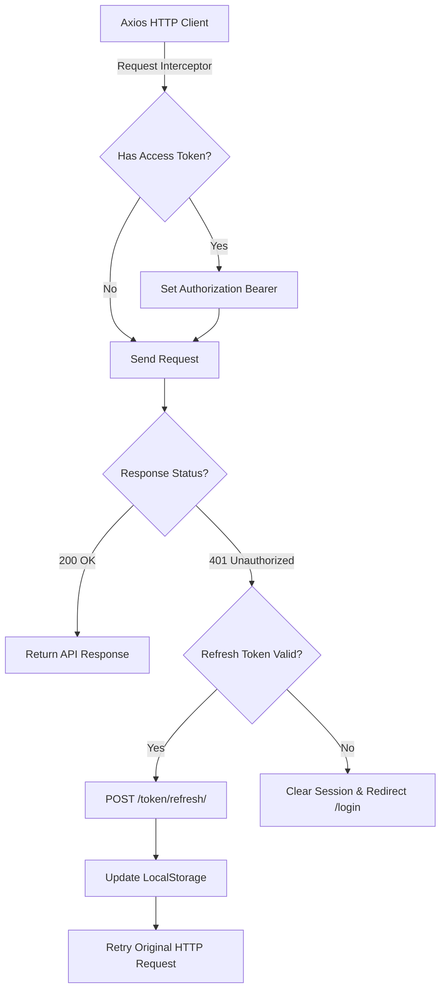

# LearnMate Technical Documentation & Architecture Reference

LearnMate is a role-based learning management and collaboration platform supporting three primary user roles: **Student**, **Mentor**, and **Admin**. 

This document provides a comprehensive blueprint of LearnMate's technical details, designed for both humans and AI agents (such as code assistants) to understand the codebase, data flows, APIs, protocols, and deployment details.

---

## Table of Contents
1. [System Architecture & Tech Stack](#1-system-architecture--tech-stack)
2. [Database Schema & Models (Role-Based)](#2-database-schema--models)
3. [Authentication & MFA Security Flows](#3-authentication--mfa-security-flows)
4. [HTTP REST API Reference](#4-http-rest-api-reference)
5. [Real-time WebSockets Communication Protocol](#5-real-time-websockets-communication-protocol)
6. [Asynchronous Operations & Celery Background Tasks](#6-asynchronous-operations--celery-background-tasks)
7. [Frontend Client Architecture & Client State](#7-frontend-client-architecture--client-state)
8. [Setup and Execution Guidelines](#8-setup-and-execution-guidelines)

---

## 1. System Architecture & Tech Stack

LearnMate follows a decoupled client-server architecture:



### Backend Stack (`/backend`)
- **Web Framework**: Django 6.0.x with Django REST Framework (DRF) 3.17.x.
- **WebSocket Engine**: Django Channels with Daphne ASGI server and `channels_redis` backend.
- **Asynchronous Processing**: Celery (running on redis broker) for background email notifications and scheduler tasks.
- **Database**: PostgreSQL (configured in `settings.py` via environment variables).
- **Authentication**: Custom JWT Authentication with `djangorestframework-simplejwt`.
- **Security & Multi-Factor**: TOTP via `pyotp` (generates custom base32 secrets) and base64 QR codes (`qrcode`).
- **SMTP Engine**: Email notification pipelines connected via Brevo SMTP credentials.

### Frontend Stack (`/frontend`)
- **Core Library**: React 19.x & React DOM 19.x.
- **Routing**: React Router DOM v7.
- **Styling**: TailwindCSS v4.
- **Build Tool**: Vite 8.x.
- **Network client**: Axios 1.18.x with interceptors for auth headers and token rotation.

---

## 2. Database Schema & Models

The backend features five primary apps: `accounts`, `profiles`, `courses`, `dashboard`, and `chat`.



### A. App: `accounts`
Handles custom user registration, authentication roles, and MFA settings.

#### Model: `User` (Extends `AbstractUser`)
- `id`: `UUIDField` (Primary Key)
- `email`: `EmailField` (Unique, acts as the username credential field)
- `role`: `CharField` (Choices: `admin`, `mentor`, `student`)
- `is_verified`: `BooleanField` (Email verification status)
- `mfa_enabled`: `BooleanField` (TOTP enabled flag)
- `mfa_secret`: `CharField` (Secret seed for TOTP authentication)

#### Model: `OTP`
- `user`: `ForeignKey` to `User`
- `code`: `CharField(max_length=6)`
- `otp_type`: `CharField` (Choices: `email_verification`, `login`, `password_reset`)
- `created_at`: `DateTimeField(auto_now_add=True)`
- `is_used`: `BooleanField`

---

### B. App: `profiles`
Role-specific profile schemas containing extra biographical data.

#### Model: `StudentProfile`
- `user`: `OneToOneField` to `User` (`related_name="student_profile"`)
- `bio`: `TextField`
- `grade`: `CharField` (e.g., Undergraduate Year 3)
- `learning_goal`: `TextField`

#### Model: `MentorProfile`
- `user`: `OneToOneField` to `User` (`related_name="mentor_profile"`)
- `specialization`: `CharField` (e.g., Quantum Mechanics)
- `experience`: `IntegerField` (Years of experience)

---

### C. App: `courses`
Holds core course contents, module breakdowns, lessons, and enrollment details.

#### Model: `Course`
- `title`: `CharField(max_length=255)`
- `description`: `TextField`
- `thumbnail`: `ImageField(upload_to="course_thumbnails/")` (Optional)
- `mentor`: `ForeignKey` to `User` (`related_name="courses"`)
- `level`: `CharField` (Choices: `beginner`, `intermediate`, `advanced`)
- `duration`: `CharField` (Estimated course length)
- `status`: `CharField` (Choices: `draft`, `published`, default=`draft`)
- `created_at`: `DateTimeField` / `updated_at`: `DateTimeField`

#### Model: `Module`
- `course`: `ForeignKey` to `Course` (`related_name="modules"`)
- `title`: `CharField`
- `description`: `TextField` (Optional)
- `order`: `PositiveIntegerField` (Sort ordering)

#### Model: `Lesson`
- `module`: `ForeignKey` to `Module` (`related_name="lessons"`)
- `title`: `CharField`
- `description`: `TextField`
- `lesson_type`: `CharField` (Choices: `video`, `pdf`, `quiz`, `assignment`)
- `video_url`: `URLField` (Optional)
- `duration`: `CharField` (Estimated lesson duration)
- `order`: `PositiveIntegerField`
- `is_preview`: `BooleanField` (Allows viewing without enrollment)

#### Model: `LessonResource`
- `lesson`: `ForeignKey` to `Lesson` (`related_name="resources"`)
- `title`: `CharField`
- `resource_type`: `CharField` (Choices: `pdf`, `document`, `image`, `video`, `link`, `zip`, `other`)
- `file`: `FileField(upload_to="lesson_resources/")` (Optional local upload)
- `external_url`: `URLField` (Optional link)

#### Model: `Enrollment`
- `student`: `ForeignKey` to `User` (`related_name="enrollments"`)
- `course`: `ForeignKey` to `Course` (`related_name="enrollments"`)
- `enrolled_at`: `DateTimeField`
- `is_completed`: `BooleanField`
- `completed_at`: `DateTimeField` (Optional)
- `is_active`: `BooleanField`
- *Constraints*: Unique student-course pairing.

#### Model: `LessonProgress`
- `student`: `ForeignKey` to `User` (`related_name="lesson_progress"`)
- `lesson`: `ForeignKey` to `Lesson` (`related_name="progress"`)
- `is_completed`: `BooleanField`
- `completed_at`: `DateTimeField`
- *Constraints*: Unique student-lesson pairing.

---

### D. App: `dashboard`
Aggregates activity logs, streak tracking, local simulated AI tutor logs.

#### Model: `StudentStreak`
- `student`: `OneToOneField` to `User`
- `days`: `IntegerField` (Consecutive login count)

#### Model: `StudentActivity`
- `student`: `ForeignKey` to `User`
- `activity_name`: `CharField`
- `category`: `CharField` (e.g. `Assignment`, `Lesson`, `Quiz`)
- `status`: `CharField` (`COMPLETED`, `PENDING`)
- `score`: `CharField` (Optional grade)
- `timestamp`: `CharField`

#### Model: `AIChatMessage` (AI Tutor Logs)
- `student`: `ForeignKey` to `User`
- `sender`: `CharField` (`ai` or `user`)
- `text`: `TextField`
- `timestamp`: `DateTimeField`

---

### E. App: `chat`
Stores direct messages and multi-user groups handled by the Daphne server.

#### Model: `ChatRoom`
- `user1`: `ForeignKey` to `User` (`related_name="chats_as_user1"`)
- `user2`: `ForeignKey` to `User` (`related_name="chats_as_user2"`)
- *Constraints*: Unique pairings.

#### Model: `Message` (Direct Room Message)
- `room`: `ForeignKey` to `ChatRoom` (`related_name="messages"`)
- `sender`: `ForeignKey` to `User`
- `receiver`: `ForeignKey` to `User`
- `message`: `TextField`
- `is_read`: `BooleanField`
- `created_at`: `DateTimeField`

#### Model: `GroupChat`
- `name`: `CharField`
- `created_by`: `ForeignKey` to `User`
- `group_type`: `CharField` (Choices: `student_batch`, `mentor_group`)
- `created_at`: `DateTimeField`

#### Model: `GroupMember`
- `group`: `ForeignKey` to `GroupChat` (`related_name="members"`)
- `user`: `ForeignKey` to `User`
- `joined_at`: `DateTimeField`

#### Model: `GroupMessage`
- `group`: `ForeignKey` to `GroupChat` (`related_name="messages"`)
- `sender`: `ForeignKey` to `User`
- `message`: `TextField`
- `created_at`: `DateTimeField`

---

## 3. Authentication & MFA Security Flows

LearnMate implements email verification + secondary TOTP verification:

### Registration and Verification Sequence


### Secure Login Sequence (with MFA Verification)


---

## 4. HTTP REST API Reference

All protected paths require the header: `Authorization: Bearer <access_token>`.

### A. Authentication & Accounts
- `POST /api/accounts/register/`: Registers credentials.
- `POST /api/accounts/send-otp/`: Triggers transactional OTP.
- `POST /api/accounts/verify-otp/`: Validates verification code, generates TOTP secret, returns base64 QR.
- `POST /api/accounts/verify-mfa-setup/`: Activates MFA using verification token.
- `POST /api/accounts/login/`: Validates password credentials.
- `POST /api/accounts/verify-mfa/`: Validates TOTP token; returns JWT access/refresh tokens.
- `POST /api/accounts/forgot-password/`: Sends password reset OTP.
- `POST /api/accounts/reset-password/`: Verifies OTP and changes password.
- `POST /api/accounts/token/refresh/`: Obtains new access token using `refresh` body payload.

### B. User Profiles
- `GET /api/profile/student/` / `PUT /api/profile/student/`: Reads or updates bio, grade, learning goals.
- `GET /api/profile/mentor/` / `PUT /api/profile/mentor/`: Reads or updates mentor specialization and experience fields.

### C. Courses App
- **Student Dashboard Endpoints**:
  - `GET /api/courses/published/`: Lists active courses available for learning.
  - `GET /api/courses/my-courses/`: Returns list of enrolled courses.
  - `POST /api/courses/<course_id>/enroll/`: Enrolls student into a course.
  - `GET /api/courses/student/<course_id>/`: Retrieves module, lesson details, and progress logs.
  - `POST /api/courses/lessons/<lesson_id>/complete/`: Marks lesson complete and logs timestamp.
  - `GET /api/courses/<course_id>/progress/`: Gets enrollment completion percentage.
  - `GET /api/courses/continue-learning/`: Returns the next sequential uncompleted lesson.
  - `POST /api/courses/<course_id>/complete-course/`: Finalizes course enrollment (marks `is_completed=True`). Triggers completion email.
- **Mentor Portal Endpoints**:
  - `GET /api/courses/mentor/dashboard/`: Core mentor portal statistics (enrolled counts, completion rates, courses summary).
  - `GET /api/courses/mentor/courses/<course_id>/students/`: Lists all student enrollments, progress, and names in a specific course.
  - `GET /api/courses/mentor/courses/<course_id>/students/<student_id>/`: Details individual student stats and dates of completed lessons.
  - `GET /api/courses/mentor/courses/<course_id>/statistics/`: Aggregates module count, enrollments, completion rates, and average progress for a course.
- **Admin Dashboard Endpoints**:
  - `GET /api/courses/admin/dashboard/`: Summarizes platform-wide metrics (total courses, lessons, users, enrollments, popular course, latest courses list).

---

## 5. Real-time WebSockets Communication Protocol

All socket protocols utilize subprotocols or custom query params for authentication.

### Room URL Schemes
- **Direct Messaging**: `ws://localhost:8000/ws/chat/<room_id>/?token=<access_token>`
- **Group Channels**: `ws://localhost:8000/ws/group/<group_id>/?token=<access_token>`
- **System Announcements**: `ws://localhost:8000/ws/broadcasts/?token=<access_token>`

### Event Payload Models (JSON)

#### 1. Instant Text Messages (Direct Chat)
- **Client to Server**:
  ```json
  { "type": "message", "message": "Hi, I am stuck on Module 2." }
  ```
- **Server Broadcast**:
  ```json
  {
    "message_data": {
      "id": 142,
      "room_id": 5,
      "message": "Hi, I am stuck on Module 2.",
      "sender": { "id": "uuid-string", "email": "student@test.com", "role": "student" },
      "receiver": { "id": "uuid-string", "email": "mentor@test.com", "role": "mentor" },
      "created_at": "2026-07-25T07:12:00.000Z",
      "is_read": false
    }
  }
  ```

#### 2. Live Typing Indicators
- **Client to Server**:
  ```json
  { "type": "typing" }
  ```
- **Server Broadcast**:
  ```json
  { "type": "typing", "user": "student@test.com" }
  ```

#### 3. Member Presence Events (Dispatched by Consumer)
- **User Online**:
  ```json
  { "type": "user_online", "user": "student@test.com" }
  ```
- **User Offline**:
  ```json
  { "type": "user_offline", "user": "student@test.com" }
  ```

---

## 6. Asynchronous Operations & Celery Background Tasks

LearnMate schedules tasks asynchronously using Celery to guarantee fast API responses and process long-running triggers.

### Celery Configuration
The config lives in **[backend/core/celery.py](file:///C:/vs code/learnmate-2/backend/core/celery.py)**, defining broker URLs and autodiscovering sub-app `tasks.py` files.

### Key Asynchronous Tasks

#### 1. Immediate Trigger: `send_course_completion_email`
- **Trigger**: Called immediately when a student hits `100%` course progression and posts to `/complete-course/`.
- **Logic**: Dispatches a congrats email asynchronously to avoid holding up the user's browser.
- **Parameters**: `user_id` (UUID), `course_id` (Int).

#### 2. Scheduled Task: `check_student_progression_nudges` (Celery Beat)
- **Schedule**: Daily.
- **Logic**: Iterates over active course enrollments. If a student's last lesson completion timestamp is older than 3 days, it locates the next logical lesson in their path. If they have not started it, a reminder notification is dispatched to their email address.

#### 3. Scheduled Task: `send_inactivity_reminders` (Celery Beat)
- **Schedule**: Every 3 days (or as scheduled).
- **Logic**: Scans for users who have not completed lessons in any of their enrolled courses for 3 days, nudging them to continue their learning streak.

---

## 7. Frontend Client Architecture & Client State

The React application is structured to handle security routing and automatic token renewal:



### State Management (`AuthContext.jsx`)
Exposes `useAuth()` to control global session structures. Saves profile details (`name`, `bio`, `learning_goal`, `grade` or `specialization`) directly in React states, updating whenever a profile edit completes.

### Route Guarding (`ProtectedRoute.jsx`)
Restricts dashboard paths according to roles:
```jsx
<Route path="/admin/dashboard" element={<ProtectedRoute allowedRoles={['admin']}><AdminDashboardOverview /></ProtectedRoute>} />
```

### Token Rotation Interceptor (`api.js`)
Configured to pause requests on `401 Unauthorized` triggers, fetch a new access token using the user's refresh token, store it, and automatically replay the original failed API request transparently.

---

## 8. Setup and Execution Guidelines

### Backend Service Setup
1. **Prepare Virtual Environment**:
   ```bash
   cd backend
   python -m venv venv
   .\venv\Scripts\activate
   ```
2. **Install Dependencies**:
   ```bash
   pip install -r requirements.txt
   ```
3. **Setup environment variables (`backend/.env`)**:
   ```env
   SECRET_KEY=your-django-key
   DEBUG=True
   DB_NAME=learnmate
   DB_USER=postgres
   DB_PASSWORD=your-postgres-password
   DB_HOST=127.0.0.1
   DB_PORT=5432
   EMAIL_HOST=smtp.brevo.com
   EMAIL_PORT=587
   EMAIL_HOST_USER=smtp-user
   EMAIL_HOST_PASSWORD=smtp-password
   EMAIL_USE_TLS=True
   DEFAULT_FROM_EMAIL=no-reply@learnmate.com
   ```
4. **Execute Migrations**:
   ```bash
   python manage.py migrate
   ```
5. **Launch Servers & Workers**:
   - **ASGI Application Webserver**:
     ```bash
     python manage.py runserver
     ```
   - **Celery Worker Processor**:
     ```bash
     celery -A core worker --pool=solo -l info
     ```
   - **Celery Beat Scheduler**:
     ```bash
     celery -A core beat -l info
     ```

### Frontend Client Setup
1. **Install Modules**:
   ```bash
   cd frontend
   npm install
   ```
2. **Launch React Client**:
   ```bash
   npm run dev
   ```
