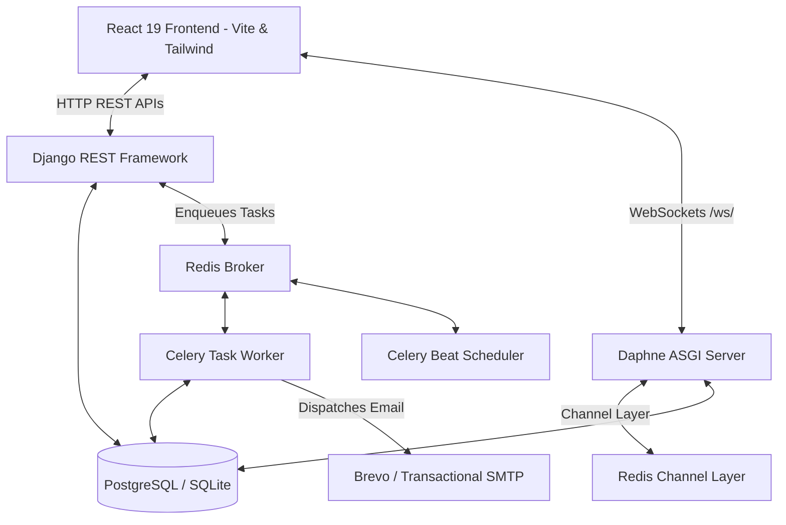
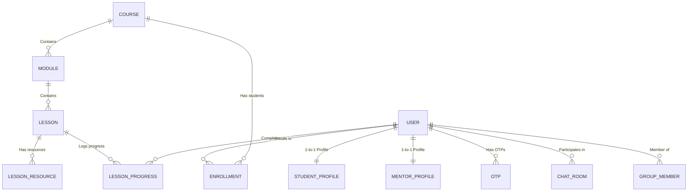

# LearnMate: Full Project Documentation (Frontend & Backend)

LearnMate is a decoupled, role-based Learning Management System (LMS) and collaborative learning platform supporting three distinct roles: **Student**, **Mentor**, and **Admin**.

This document serves as a complete technical guide covering both **Frontend** and **Backend** architectures, database design, API specifications, real-time protocols, asynchronous workers, and setup instructions.

---

## Table of Contents
1. [Executive Overview & Tech Stack](#1-executive-overview--tech-stack)
2. [System Architecture](#2-system-architecture)
3. [Database Models & ER Schema](#3-database-models--er-schema)
4. [Backend Deep Dive (Django & DRF)](#4-backend-deep-dive-django--drf)
5. [Frontend Deep Dive (React & Tailwind)](#5-frontend-deep-dive-react--tailwind)
6. [Authentication, Security & MFA Pipeline](#6-authentication-security--mfa-pipeline)
7. [Real-time WebSockets Chat System](#7-real-time-websockets-chat-system)
8. [Asynchronous Workers & Background Tasks (Celery + Redis)](#8-asynchronous-workers--background-tasks-celery--redis)
9. [Complete HTTP REST API Reference](#9-complete-http-rest-api-reference)
10. [Local Development & Deployment Setup](#10-local-development--deployment-setup)

---

## 1. Executive Overview & Tech Stack

LearnMate connects learners with mentors and administrators in a single integrated ecosystem. 

### Technology Stack Summary

| Domain | Technology | Key Usage / Details |
|---|---|---|
| **Backend Core** | Python 3.10+, Django 6.0, Django REST Framework (DRF) 3.17 | REST APIs, authentication, permissions, database models |
| **Realtime Engine** | Django Channels 4.x, Daphne (ASGI), Redis Channel Layer | WebSockets broadcasting for 1-on-1 and Group Chat |
| **Task Queue** | Celery 5.x, Redis, django-celery-beat | Async email delivery (OTP, completion, nudges), periodic reminders |
| **Database** | SQLite (`db.sqlite3` dev) / PostgreSQL (production) | User data, course materials, enrollment tracking, chat history |
| **Frontend Core** | React 19, Vite, React Router v7 | Single Page Application (SPA), role-based dynamic routing |
| **Styling & UI** | TailwindCSS v4, Lucide Icons | Responsive modern dashboards, interactive UI controls |
| **HTTP & State** | Axios 1.18, React Context API (`AuthContext`) | Automated JWT rotation interceptors, central session state |

---

## 2. System Architecture

LearnMate follows a decoupled client-server architecture. The React frontend interacts with the backend over RESTful HTTP endpoints for stateful operations and WebSockets for real-time chat updates.



---

## 3. Database Models & ER Schema

The database architecture is partitioned into modular Django apps: `accounts`, `profiles`, `courses`, `dashboard`, and `chat`.



### Key Models Dictionary

#### 1. Accounts (`apps/accounts`)
* **`User`** (Custom AbstractUser): Core identity model with UUID primary keys.
  * Fields: `id` (UUID), `email` (Unique username field), `role` (`student` | `mentor` | `admin`), `is_verified` (Boolean), `mfa_enabled` (Boolean), `mfa_secret` (TOTP seed).
* **`OTP`**: Temporary verification tokens.
  * Fields: `user` (FK), `code` (6-digit string), `otp_type` (`email_verification` | `login` | `password_reset`), `is_used` (Boolean), `created_at`.

#### 2. Profiles (`apps/profiles`)
* **`StudentProfile`**: Extended learner metadata created automatically via signals.
  * Fields: `user` (1-to-1), `bio`, `grade`, `learning_goal`.
* **`MentorProfile`**: Extended instructor metadata.
  * Fields: `user` (1-to-1), `specialization`, `experience` (Years).

#### 3. Courses (`apps/courses`)
* **`Course`**: Curriculum container managed by Mentors.
  * Fields: `title`, `description`, `thumbnail`, `mentor` (FK User), `level` (`beginner` | `intermediate` | `advanced`), `duration`, `status` (`draft` | `published`).
* **`Module`**: Chapter/unit within a course.
  * Fields: `course` (FK), `title`, `description`, `order`.
* **`Lesson`**: Learning items under a module.
  * Fields: `module` (FK), `title`, `description`, `lesson_type` (`video` | `pdf` | `quiz` | `assignment`), `video_url`, `duration`, `order`, `is_preview`.
* **`LessonResource`**: Attached downloadable files or external resource links.
  * Fields: `lesson` (FK), `title`, `resource_type`, `file`, `external_url`.
* **`Enrollment`**: Student course registration.
  * Fields: `student` (FK User), `course` (FK Course), `enrolled_at`, `is_completed`, `completed_at`.
* **`LessonProgress`**: Fine-grained lesson completion tracking.
  * Fields: `student` (FK User), `lesson` (FK Lesson), `is_completed`, `completed_at`.

#### 4. Chat (`apps/chat`)
* **`ChatRoom`**: 1-on-1 direct conversation container between two users (`user1`, `user2`).
* **`Message`**: Direct message items (`room`, `sender`, `receiver`, `message`, `is_read`, `created_at`).
* **`GroupChat`**: Multi-user group (`name`, `created_by`, `group_type`: `student_batch` | `mentor_group`).
* **`GroupMember`**: Group membership association (`group`, `user`).
* **`GroupMessage`**: Message post inside a group channel (`group`, `sender`, `message`, `created_at`).

---

## 4. Backend Deep Dive (Django & DRF)

The backend is modularized under `backend/apps/`:
* `apps/accounts`: Auth logic, custom JWT serializer, TOTP/MFA engine using `pyotp` & `qrcode`.
* `apps/profiles`: Signal handlers (`post_save`) for auto-creating `StudentProfile` / `MentorProfile`.
* `apps/courses`: Nested REST viewsets & APIViews handling course creation, lesson completion, and progress calculation.
* `apps/chat`: Consumers (`ChatConsumer`, `GroupConsumer`) handling ASGI WebSockets protocol.
* `apps/ai` & `apps/adminpanel`: Platform oversight endpoints and AI tutor integration.

---

## 5. Frontend Deep Dive (React & Tailwind)

The frontend application resides in `frontend/` built with React 19 + Vite.

### Core Structure & Flow
* **`src/App.jsx`**: Main routing declaration with dynamic role-guarded routes via `ProtectedRoute`.
* **`src/api.js`**: Central Axios instance with request and response interceptors.
  * *Automatic JWT Rotation*: Intercepts HTTP 401 errors, seamlessly issues a call to `/api/accounts/token/refresh/`, updates tokens in `localStorage`, and replays the original request without disrupting the user experience.
* **`src/context/AuthContext.jsx`**: React Context exposing global authentication state (`user`, `token`, `role`) and authentication methods (`login`, `logout`, `refreshUser`).
* **`src/pages/dashboards/`**: Role-specific UI layouts:
  * Student Dashboard: Course discovery, lesson viewer, learning streaks, progress metrics.
  * Mentor Dashboard: Course builder, module/lesson editor, enrolled student analytics.
  * Admin Dashboard: User management, verification control, platform metrics.

---

## 6. Authentication, Security & MFA Pipeline

LearnMate implements a multi-step verification process to ensure account security.

### Registration & MFA Setup
1. **Account Registration**: User submits signup credentials (`POST /api/accounts/register/`).
2. **OTP Dispatch**: System sends a 6-digit verification code to user's email (`POST /api/accounts/send-otp/`).
3. **Email Verification & MFA Secret Generation**: User verifies OTP (`POST /api/accounts/verify-otp/`). The system responds with a base64 encoded QR Code containing a unique TOTP seed (`pyotp`).
4. **MFA Activation**: User scans the QR code in Google Authenticator or Microsoft Authenticator and enters the 6-digit TOTP token (`POST /api/accounts/verify-mfa-setup/`) to complete activation.

### Two-Step Login Flow
1. **Password Authentication**: Client submits email and password (`POST /api/accounts/login/`). Server returns `{ "mfa_required": true }`.
2. **Authenticator Challenge**: Client prompts for the 6-digit TOTP code and submits it (`POST /api/accounts/verify-mfa/`). Server returns access and refresh JWT tokens.

---

## 7. Real-time WebSockets Chat System

Real-time communication is enabled using Django Channels with Daphne and Redis.

### WebSocket Connection Endpoints
* **Direct 1-on-1 Chat**: `ws://localhost:8000/ws/chat/<room_id>/?token=<JWT>`
* **Group Chat**: `ws://localhost:8000/ws/group/<group_id>/?token=<JWT>`

### Handshake & Messaging Protocol
* **Authentication**: Handled by custom `JWTAuthMiddleware` extracting and validating token from URL query params.
* **Events Supported**:
  * Outgoing message: `{ "type": "message", "message": "Content..." }`
  * Incoming broadcast: `{ "message_data": { "id": 1, "sender": {...}, "message": "Content...", "created_at": "..." } }`
  * Typing status: `{ "type": "typing" }`
  * Presence updates: `{ "type": "user_online", "user": "email@test.com" }`

---

## 8. Asynchronous Workers & Background Tasks (Celery + Redis)

 Celery manages asynchronous processing and scheduled jobs.

* **Task Engine**: Configured in `backend/core/celery.py`.
* **Message Broker & Result Storage**: Redis running on `redis://127.0.0.1:6379/0`.
* **Periodic Execution**: `django-celery-beat` schedules recurring jobs.

### Registered Celery Tasks
1. `send_course_completion_email(user_id, course_id)`: Triggered asynchronously upon reaching 100% course progress.
2. `send_inactivity_reminders()`: Daily cron job identifying students inactive for 3+ days and sending email reminders.
3. `check_student_progression_nudges()`: Daily cron job prompting students with details on their next uncompleted lesson.

---

## 9. Complete HTTP REST API Reference

All protected endpoints require header: `Authorization: Bearer <access_token>`.

### Auth & Accounts
| Method | Endpoint | Description | Public / Protected |
|---|---|---|---|
| `POST` | `/api/accounts/register/` | Register new user account | Public |
| `POST` | `/api/accounts/send-otp/` | Send email verification OTP | Public |
| `POST` | `/api/accounts/verify-otp/` | Verify OTP code & return TOTP QR code | Public |
| `POST` | `/api/accounts/verify-mfa-setup/` | Finalize MFA authenticator setup | Public |
| `POST` | `/api/accounts/login/` | Step-1 credential verification | Public |
| `POST` | `/api/accounts/verify-mfa/` | Step-2 TOTP verification (returns JWTs) | Public |
| `POST` | `/api/accounts/token/refresh/` | Rotate expired access token | Public |

### User Profiles
| Method | Endpoint | Description | Allowed Roles |
|---|---|---|---|
| `GET` / `PUT` | `/api/profile/student/` | Retrieve/Update student bio, grade, goals | Student |
| `GET` / `PUT` | `/api/profile/mentor/` | Retrieve/Update mentor specialization | Mentor |

### Course Management & Learning
| Method | Endpoint | Description | Allowed Roles |
|---|---|---|---|
| `GET` | `/api/courses/` | List all published public courses | Student / Public |
| `POST` | `/api/courses/create/` | Create a new course container | Mentor |
| `GET` / `PUT` | `/api/courses/<course_id>/` | View / Edit course details | Mentor |
| `POST` | `/api/courses/modules/create/` | Add module to course | Mentor |
| `POST` | `/api/courses/lessons/create/` | Add lesson to module | Mentor |
| `POST` | `/api/courses/student/<id>/enroll/` | Enroll student into course | Student |
| `POST` | `/api/courses/lessons/<id>/complete/`| Mark specific lesson completed | Student |
| `POST` | `/api/courses/student/courses/<id>/complete/`| Complete entire course | Student |

### Analytics & Messaging
| Method | Endpoint | Description | Allowed Roles |
|---|---|---|---|
| `GET` | `/api/dashboard/student/` | Student streaks, recent activity | Student |
| `GET` | `/api/courses/mentor/dashboard/` | Mentor enrolled metrics | Mentor |
| `GET` | `/api/dashboard/admin/` | Platform user counts & MFA stats | Admin |
| `GET` | `/api/chat/rooms/` | Get active direct message rooms | All Authenticated |
| `GET` | `/api/chat/groups/` | Get user group chats | All Authenticated |

---

## 10. Local Development & Deployment Setup

### Prerequisites
* Python 3.10+
* Node.js 18+
* Redis Server running locally (`localhost:6379`)

### Backend Setup Steps
```bash
# 1. Enter backend directory & create virtual environment
cd backend
python -m venv venv

# Activate venv:
# Windows: .\venv\Scripts\activate
# Linux/macOS: source venv/bin/activate

# 2. Install Python dependencies
pip install -r requirements.txt

# 3. Configure environment variables in backend/.env
# DB_NAME=learnmate, DB_USER=postgres, CELERY_BROKER_URL=redis://127.0.0.1:6379/0, etc.

# 4. Run database migrations
python manage.py migrate

# 5. Start Daphne ASGI Server
python manage.py runserver

# 6. Start Celery Worker (In a separate terminal window)
# Windows: python -m celery -A core worker --loglevel=info -P threads
# Linux/macOS: celery -A core worker -l info

# 7. Start Celery Beat Scheduler (In a separate terminal window)
python -m celery -A core beat -l info
```

### Frontend Setup Steps
```bash
# 1. Enter frontend directory
cd frontend

# 2. Install Node packages
npm install

# 3. Start Vite dev server
npm run dev
```
The application UI will run at `http://localhost:5173`.
