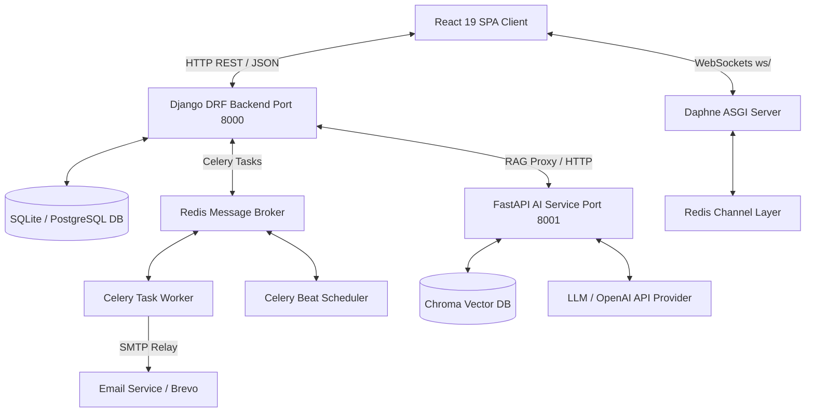
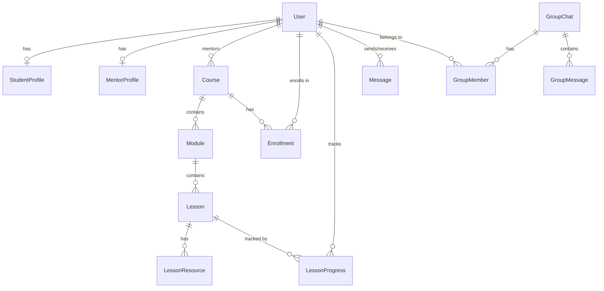

# LearnMate Full Project Technical Documentation

> **LearnMate**: A role-based, AI-powered Learning Management System (LMS) and Real-time Collaborative Platform.
> **Date**: August 2026  
> **Version**: 2.0.0  

---

## Table of Contents
1. [Executive Overview & Architecture](#1-executive-overview--architecture)
2. [Technology Stack](#2-technology-stack)
3. [Database Schema & Data Models](#3-database-schema--data-models)
4. [Backend System Deep Dive (Django REST Framework)](#4-backend-system-deep-dive-django-rest-framework)
5. [Authentication, Security & MFA Pipeline](#5-authentication-security--mfa-pipeline)
6. [Real-time WebSockets Chat System](#6-real-time-websockets-chat-system)
7. [AI Microservice & RAG Engine (FastAPI + Chroma DB)](#7-ai-microservice--rag-engine-fastapi--chroma-db)
8. [Background Worker & Task Scheduling (Celery + Redis)](#8-background-worker--task-scheduling-celery--redis)
9. [Frontend Deep Dive (React + Vite + Tailwind CSS)](#9-frontend-deep-dive-react--vite--tailwind-css)
10. [Comprehensive HTTP REST API Reference](#10-comprehensive-http-rest-api-reference)
11. [Environment Setup & Running Locally](#11-environment-setup--running-locally)

---

## 1. Executive Overview & Architecture

**LearnMate** is a multi-role learning platform designed to bridge the gap between Students, Mentors, and Administrators. It combines traditional course management with real-time WebSocket communication and a Retrieval-Augmented Generation (RAG) AI assistant grounded in course video transcripts.

### High-Level System Architecture



### Key System Highlights
- **Decoupled Client-Server**: React Single Page Application (SPA) communicating over REST APIs and WebSockets.
- **Three-Tier User Roles**:
  - **Student**: Course consumption, interactive lesson viewing, AI tutoring grounded in course material, real-time messaging with mentors.
  - **Mentor**: Course creation, syllabus modular editing, resource upload, student progress analytics, group/direct messaging.
  - **Admin**: Platform user management, mentor verification/approval, course moderation, AI tutor logs, system reporting.
- **AI-Powered RAG Microservice**: FastAPI server processing lesson transcripts into chunked vector embeddings stored in Chroma DB to deliver context-grounded AI responses.
- **Real-Time Messaging**: Django Channels & Redis facilitating instant 1-on-1 mentor-student chat and group batch messaging.

---

## 2. Technology Stack

| Layer / Component | Technology | Specification / Version | Key Responsibility |
|---|---|---|---|
| **Frontend Framework** | React | `19.x` | User interface, Single Page Application rendering |
| **Build Tooling** | Vite | `8.x` | HMR development server & production builder |
| **Routing** | React Router DOM | `v7.x` | Client-side role-based router & layout guards |
| **Styling & UI** | Tailwind CSS | `v4.x` | Custom utility-first responsive styling |
| **Icons & Micro-UI** | Lucide React | `0.4x` | Modern SVG iconography |
| **HTTP Client** | Axios | `1.18.x` | API communication with automated JWT refresh interceptors |
| **Backend Core** | Python / Django | Python `3.10+`, Django `6.0.x` | Core REST APIs, models, ORM, business logic |
| **API Engine** | Django REST Framework | `3.17.x` | Serializers, permissions, viewsets, authentication |
| **Realtime Engine** | Django Channels & Daphne | Channels `4.x`, Daphne ASGI | WebSocket protocol handler for live chats |
| **Channel Layer** | Redis | Redis Server + `channels_redis` | Distributed WebSocket state message broker |
| **Task Queue** | Celery & Celery Beat | `5.x`, `django-celery-beat` | Async emails, reminder notifications, scheduled jobs |
| **AI Microservice** | FastAPI | `0.110+` | Dedicated RAG embedding & search service on port 8001 |
| **Vector DB** | Chroma DB | `0.5+` | Persistent vector store for lesson transcript chunks |
| **Database** | SQLite / PostgreSQL | `SQLite3` (dev), `PostgreSQL` (prod) | Relational storage for users, courses, messages |

---

## 3. Database Schema & Data Models

The database models are distributed across Django apps: `accounts`, `profiles`, `courses`, and `chat`.



### 3.1 Accounts App (`apps/accounts/models.py`)

#### `User` (Extends `AbstractUser`)
- **`id`** (`UUIDField`, Primary Key, default `uuid.uuid4`)
- **`email`** (`EmailField`, Unique, used as `USERNAME_FIELD`)
- **`username`** (`CharField`, required)
- **`role`** (`CharField`, choices: `admin`, `mentor`, `student`, default: `student`)
- **`is_verified`** (`BooleanField`, default `False`)
- **`mfa_enabled`** (`BooleanField`, default `False`)
- **`mfa_secret`** (`CharField`, nullable, TOTP secret key)
- **`created_at`**, **`updated_at`** (`DateTimeField`)

#### `OTP`
- **`user`** (`ForeignKey` -> `User`, `CASCADE`)
- **`code`** (`CharField`, 6 digits)
- **`otp_type`** (`CharField`, choices: `email_verification`, `login`, `password_reset`)
- **`is_used`** (`BooleanField`, default `False`)
- **`created_at`** (`DateTimeField`, auto_now_add)

### 3.2 Profiles App (`apps/profiles/models.py`)

#### `StudentProfile`
- **`user`** (`OneToOneField` -> `User`, `related_name="student_profile"`)
- **`bio`** (`TextField`, optional)
- **`grade`** (`CharField`, optional)
- **`learning_goal`** (`TextField`, optional)

#### `MentorProfile`
- **`user`** (`OneToOneField` -> `User`, `related_name="mentor_profile"`)
- **`specialization`** (`CharField`, optional)
- **`experience`** (`IntegerField`, default `0`)

### 3.3 Courses App (`apps/courses/models.py`)

#### `Course`
- **`title`** (`CharField`, max 255)
- **`description`** (`TextField`)
- **`thumbnail`** (`ImageField`, upload_to `course_thumbnails/`, optional)
- **`mentor`** (`ForeignKey` -> `User`, `related_name="courses"`)
- **`level`** (`CharField`, choices: `beginner`, `intermediate`, `advanced`)
- **`duration`** (`CharField`)
- **`status`** (`CharField`, choices: `draft`, `published`, `rejected`, default: `draft`)
- **`created_at`**, **`updated_at`** (`DateTimeField`)

#### `Module`
- **`course`** (`ForeignKey` -> `Course`, `related_name="modules"`)
- **`title`** (`CharField`)
- **`description`** (`TextField`, optional)
- **`order`** (`PositiveIntegerField`)

#### `Lesson`
- **`module`** (`ForeignKey` -> `Module`, `related_name="lessons"`)
- **`title`** (`CharField`)
- **`description`** (`TextField`, optional)
- **`lesson_type`** (`CharField`, choices: `video`, `pdf`, `quiz`, `assignment`)
- **`video_url`** (`URLField`, optional)
- **`duration`** (`CharField`, optional)
- **`order`** (`PositiveIntegerField`)
- **`is_preview`** (`BooleanField`, default `False`)
- **`transcript`** (`TextField`, processed English transcript for RAG)
- **`original_transcript`** (`TextField`, raw original language transcript)
- **`transcript_status`** (`CharField`, choices: `pending`, `processing`, `completed`, `failed`)

#### `LessonResource`
- **`lesson`** (`ForeignKey` -> `Lesson`, `related_name="resources"`)
- **`title`** (`CharField`)
- **`resource_type`** (`CharField`, choices: `pdf`, `document`, `image`, `video`, `link`, `zip`, `other`)
- **`file`** (`FileField`, upload_to `lesson_resources/`, optional)
- **`external_url`** (`URLField`, optional)

#### `Enrollment`
- **`student`** (`ForeignKey` -> `User`, `related_name="enrollments"`)
- **`course`** (`ForeignKey` -> `Course`, `related_name="enrollments"`)
- **`enrolled_at`** (`DateTimeField`, auto_now_add)
- **`is_completed`** (`BooleanField`, default `False`)
- **`completed_at`** (`DateTimeField`, nullable)
- **`is_active`** (`BooleanField`, default `True`)
- **Constraint**: `unique_together = ("student", "course")`

#### `LessonProgress`
- **`student`** (`ForeignKey` -> `User`, `related_name="lesson_progress"`)
- **`lesson`** (`ForeignKey` -> `Lesson`, `related_name="progress"`)
- **`is_completed`** (`BooleanField`, default `False`)
- **`completed_at`** (`DateTimeField`, nullable)
- **Constraint**: `unique_together = ("student", "lesson")`

### 3.4 Chat App (`apps/chat/models.py`)

#### `ChatRoom` (1-on-1 Direct Chat)
- **`user1`**, **`user2`** (`ForeignKey` -> `User`)
- **Constraint**: `unique_together = ("user1", "user2")`

#### `Message`
- **`room`** (`ForeignKey` -> `ChatRoom`, `related_name="messages"`)
- **`sender`**, **`receiver`** (`ForeignKey` -> `User`)
- **`message`** (`TextField`)
- **`is_read`** (`BooleanField`, default `False`)
- **`created_at`** (`DateTimeField`)

#### `GroupChat`
- **`name`** (`CharField`, max 100)
- **`created_by`** (`ForeignKey` -> `User`)
- **`group_type`** (`CharField`, choices: `student_batch`, `mentor_group`)

#### `GroupMember` & `GroupMessage`
- Connects users to `GroupChat` rooms and stores broadcast messages.

---

## 4. Backend System Deep Dive (Django REST Framework)

The Django backend serves as the core business logic engine, API authority, and coordinator for AI and background jobs.

### Directory Architecture
```
backend/
├── core/
│   ├── settings.py         # App configuration, Database, Celery, CORS, JWT, Channels
│   ├── urls.py             # Root URL routing for /api/
│   ├── asgi.py             # ASGI entrypoint routing HTTP to WSGI and ws/ to Channels
│   └── celery.py           # Celery application setup
├── apps/
│   ├── accounts/           # User model, Auth APIs, OTP, MFA (TOTP)
│   ├── profiles/           # Student & Mentor profile management APIs
│   ├── courses/            # Course creation, Module/Lesson editor, Progress & Resources
│   ├── chat/               # Direct & Group WebSocket consumers and history APIs
│   ├── adminpanel/         # System analytics, moderation, user management
│   └── ai/                 # Gateway to FastAPI RAG Service & fallback chatbot
├── manage.py
└── requirements.txt
```

---

## 5. Authentication, Security & MFA Pipeline

LearnMate implements a multi-tiered security pipeline using JWT (`djangorestframework-simplejwt`) and Time-based One-Time Passwords (`pyotp`).

### 5.1 Registration & Verification Flow
1. **User Registration**: `POST /api/accounts/register/` creates an unverified account (`is_verified=False`).
2. **OTP Dispatch**: `POST /api/accounts/send-otp/` generates a 6-digit OTP code stored in `OTP` model and dispatches via SMTP (or Celery task).
3. **Verification**: `POST /api/accounts/verify-otp/` matches code against active OTPs. On success, `is_verified` becomes `True`.

### 5.2 Login & Token Generation Flow
1. **Credentials Validation**: `POST /api/accounts/login-otp/` validates `email` and `password`.
2. **Login OTP**: On valid credentials, a login OTP is sent to the user's email.
3. **Token Issuance**: `POST /api/accounts/verify-login-otp/` validates the OTP and returns JWT tokens:
   - **`access`**: Short-lived Bearer token (15-60 mins).
   - **`refresh`**: Long-lived token used to acquire new access tokens via `POST /api/accounts/token/refresh/`.

### 5.3 TOTP Multi-Factor Authentication (MFA)
- Users can enable TOTP MFA via `POST /api/accounts/mfa/enable/` which returns a secret key and a QR code URI generated with `qrcode`.
- Verification of TOTP setup occurs via `POST /api/accounts/mfa/verify/` using `pyotp`.

---

## 6. Real-time WebSockets Chat System

Real-time messaging is powered by **Django Channels**, **Daphne**, and **Redis**.

### 6.1 Architecture & Endpoints
- **Direct 1-on-1 Chat**: `ws://<host>/ws/chat/<receiver_id>/`
- **Group Batch Chat**: `ws://<host>/ws/group-chat/<group_id>/`

### 6.2 Consumer Logic (`apps/chat/consumers.py`)
1. On WebSocket connection handshake:
   - Evaluates JWT token from query string or request headers.
   - Extracts sender identity (`user.id`).
   - Generates deterministic room channel name (e.g. `chat_userA_userB`).
   - Subscribes connection to Redis channel layer group.
2. On receive event (`receive_json`):
   - Saves message to SQLite/PostgreSQL `Message` table.
   - Broadcasts JSON payload to group channel.
3. On disconnect:
   - Unsubscribes client from channel group.

---

## 7. AI Microservice & RAG Engine (FastAPI + Chroma DB)

Located in `ai-service/`, this standalone microservice provides Retrieval-Augmented Generation (RAG) grounded in lesson transcripts.

### 7.1 Architecture & Components
```
ai-service/
├── main.py                 # FastAPI application routes
├── services/
│   ├── embeddings.py       # Sentence chunking & embedding generation
│   ├── vectorstore.py      # Chroma DB collection manager (upsert/delete)
│   └── rag.py              # Relevant chunk retrieval & LLM context synthesis
└── chroma_data/            # Persistent vector DB storage
```

### 7.2 Microservice Endpoints
- **`POST /embed`**:
  - Request: `{ "lesson_id": int, "course_id": int, "transcript_text": str }`
  - Action: Chunks text using sliding window, generates embeddings, stores vectors in Chroma DB tagged with `course_id` and `lesson_id`.
- **`POST /rag-chat`**:
  - Request: `{ "question": str, "course_id": int }`
  - Action: Embeds question, queries Chroma DB for top matching chunks within `course_id`, passes context to LLM, returns grounded answer.
- **`DELETE /lesson/{lesson_id}`**:
  - Action: Purges vector chunks associated with the deleted/updated lesson.
- **`GET /health`**:
  - Service health status check (`{"status": "ok"}`).

---

## 8. Background Worker & Task Scheduling (Celery + Redis)

Asynchronous and scheduled background jobs are handled by **Celery worker** and **Celery Beat** driven by a Redis message broker.

### Key Background Tasks
- **`send_async_otp_email`**: Dispatches transactional OTP email messages asynchronously to prevent blocking API request handlers.
- **`send_course_completion_email`**: Automatically dispatches congratulations and certificates upon course completion.
- **`daily_learning_reminder_nudge`**: Scheduled cron job via Celery Beat sending daily activity reminder emails to inactive students.

---

## 9. Frontend Deep Dive (React + Vite + Tailwind CSS)

The frontend is structured into modular roles and reusable components.

### 9.1 Directory Structure
```
frontend/src/
├── api.js                   # Axios setup with request/response JWT interceptors
├── App.jsx                  # Main router setup & role-based route guards
├── context/
│   └── AuthContext.jsx      # Global auth state, user profile, login/logout handlers
├── components/
│   ├── ProtectedRoute.jsx   # Route access guard based on user roles
│   ├── DashboardLayout.jsx  # Wrapper layout with Sidebar & Topbar
│   ├── Sidebar.jsx          # Role-aware navigation sidebar
│   ├── Topbar.jsx           # User profile header & notification tray
│   ├── ChatComponent.jsx    # Real-time 1-on-1 WebSocket chat window
│   ├── GroupChatComponent.jsx # Real-time group WebSocket chat window
│   └── LessonAIChat.jsx     # Slide-over AI assistant window grounded in lesson
└── pages/
    ├── auth/                # Login, Register, ForgotPassword pages
    └── dashboards/
        ├── admin/           # Users, Mentors, Courses, Reports, AI Tutor logs
        ├── mentor/          # Overview, Syllabus Editor, Students, Resources, AI Tutor
        └── student/         # Overview, Course Viewer, Lesson Viewer, AI Tutor, Progress
```

### 9.2 Token Rotation & Axios Interceptor Logic (`api.js`)
- Request Interceptor: Automatically attaches `Authorization: Bearer <access_token>` header to all outgoing requests if token exists in `localStorage`.
- Response Interceptor: Listens for `401 Unauthorized`. If access token is expired, holds original request, calls `POST /api/accounts/token/refresh/` with `refresh_token`, saves new access token, and retries original request transparently.

---

## 10. Comprehensive HTTP REST API Reference

### 10.1 Authentication & Accounts (`/api/accounts/`)

| Method | Endpoint | Description | Auth Required |
|---|---|---|---|
| POST | `/api/accounts/register/` | Register new student/mentor account | None |
| POST | `/api/accounts/send-otp/` | Send email verification OTP | None |
| POST | `/api/accounts/verify-otp/` | Verify email address using OTP | None |
| POST | `/api/accounts/login-otp/` | Validate credentials & trigger login OTP | None |
| POST | `/api/accounts/verify-login-otp/` | Verify login OTP & return JWT tokens | None |
| POST | `/api/accounts/forgot-password/` | Send password reset OTP | None |
| POST | `/api/accounts/reset-password/` | Execute password reset with OTP | None |
| POST | `/api/accounts/token/` | Direct JWT token issuance | None |
| POST | `/api/accounts/token/refresh/` | Obtain fresh access token via refresh token | None |
| POST | `/api/accounts/mfa/enable/` | Enable TOTP MFA and receive secret/QR code | Bearer Token |
| POST | `/api/accounts/mfa/verify/` | Confirm TOTP MFA setup code | Bearer Token |

### 10.2 Profiles (`/api/profile/`)

| Method | Endpoint | Description | Auth Required |
|---|---|---|---|
| GET / PUT | `/api/profile/student/` | Get or update student profile details | Bearer (Student) |
| GET / PUT | `/api/profile/mentor/` | Get or update mentor profile details | Bearer (Mentor) |

### 10.3 Course Management (`/api/courses/`)

| Method | Endpoint | Description | Auth Required |
|---|---|---|---|
| GET / POST | `/api/courses/` | List all courses or create course | Bearer Token |
| GET / PUT / DEL | `/api/courses/<id>/` | Course detail, update, delete | Bearer (Mentor/Admin) |
| GET / POST | `/api/courses/<id>/modules/` | List or create modules in a course | Bearer (Mentor) |
| GET / POST | `/api/courses/modules/<id>/lessons/` | List or create lessons in a module | Bearer (Mentor) |
| GET / PUT / DEL | `/api/courses/lessons/<id>/` | Lesson detail, update, delete | Bearer (Mentor) |
| GET / POST | `/api/courses/lessons/<id>/resources/` | List or upload lesson resources | Bearer (Mentor) |

### 10.4 Student Course View & Progress (`/api/courses/student/`)

| Method | Endpoint | Description | Auth Required |
|---|---|---|---|
| GET | `/api/courses/student/` | Browse catalog of published courses | Bearer (Student) |
| POST | `/api/courses/student/enroll/<course_id>/` | Enroll student into target course | Bearer (Student) |
| GET | `/api/courses/student/my-courses/` | List courses currently enrolled by student | Bearer (Student) |
| GET | `/api/courses/student/<id>/` | Get student view of course details | Bearer (Student) |
| GET | `/api/courses/student/<id>/modules/` | View course module syllabus | Bearer (Student) |
| GET | `/api/courses/student/modules/<id>/lessons/` | View lessons inside a module | Bearer (Student) |
| GET | `/api/courses/student/lessons/<id>/` | View lesson content & video | Bearer (Student) |
| POST | `/api/courses/student/lessons/<id>/complete/` | Mark lesson as completed | Bearer (Student) |
| GET | `/api/courses/student/courses/<id>/progress/` | Get student progress percentage | Bearer (Student) |

### 10.5 Chat & Messaging (`/api/chat/`)

| Method | Endpoint | Description | Auth Required |
|---|---|---|---|
| GET | `/api/chat/history/<receiver_id>/` | Fetch 1-on-1 direct message history | Bearer Token |
| GET | `/api/chat/groups/` | List all group chats joined by user | Bearer Token |
| GET | `/api/chat/groups/<group_id>/messages/` | Fetch historical group messages | Bearer Token |

### 10.6 Admin Panel (`/api/adminpanel/`)

| Method | Endpoint | Description | Auth Required |
|---|---|---|---|
| GET | `/api/adminpanel/dashboard/` | Get high-level platform statistics | Bearer (Admin) |
| GET / PUT | `/api/adminpanel/users/` | List or modify platform users | Bearer (Admin) |
| GET / PUT | `/api/adminpanel/mentors/` | List or approve/reject mentor applications | Bearer (Admin) |
| GET / PUT | `/api/adminpanel/courses/` | Moderate or approve courses | Bearer (Admin) |
| GET | `/api/adminpanel/reports/` | System analytics and usage reporting | Bearer (Admin) |

### 10.7 AI Tutor Endpoint (`/api/ai/`)

| Method | Endpoint | Description | Auth Required |
|---|---|---|---|
| POST | `/api/ai/chat/` | Send message to AI Tutor (proxies to RAG service if `course_id` provided) | Bearer Token |

---

## 11. Environment Setup & Running Locally

### 11.1 Prerequisites
- Python 3.10+
- Node.js 18+ and npm
- Redis Server (running on default port 6379)

### 11.2 Backend Setup (`/backend`)
```bash
cd backend
python -m venv venv
# On Windows:
venv\Scripts\activate
# On Linux/macOS:
source venv/bin/activate

pip install -r requirements.txt
python manage.py migrate
python manage.py runserver 0.0.0.0:8000
```

### 11.3 Celery Worker & Beat Setup (`/backend`)
```bash
# In separate terminal window with virtualenv active:
python -m celery -A core worker --loglevel=info -P threads
python -m celery -A core beat --loglevel=info
```

### 11.4 AI Microservice Setup (`/ai-service`)
```bash
cd ai-service
python -m venv venv
# Activate venv & install dependencies
pip install fastapi uvicorn chroma-data sentence-transformers requests
uvicorn main:app --reload --port 8001
```

### 11.5 Frontend Setup (`/frontend`)
```bash
cd frontend
npm install
npm run dev
```

---
*Documentation maintained by LearnMate Engineering Team.*
